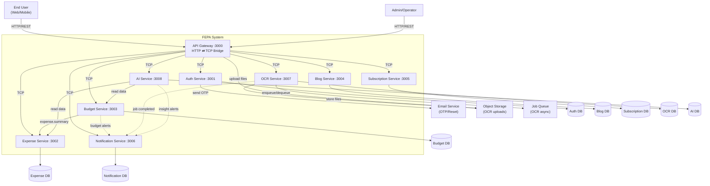
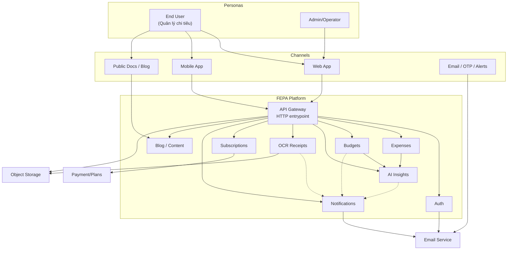
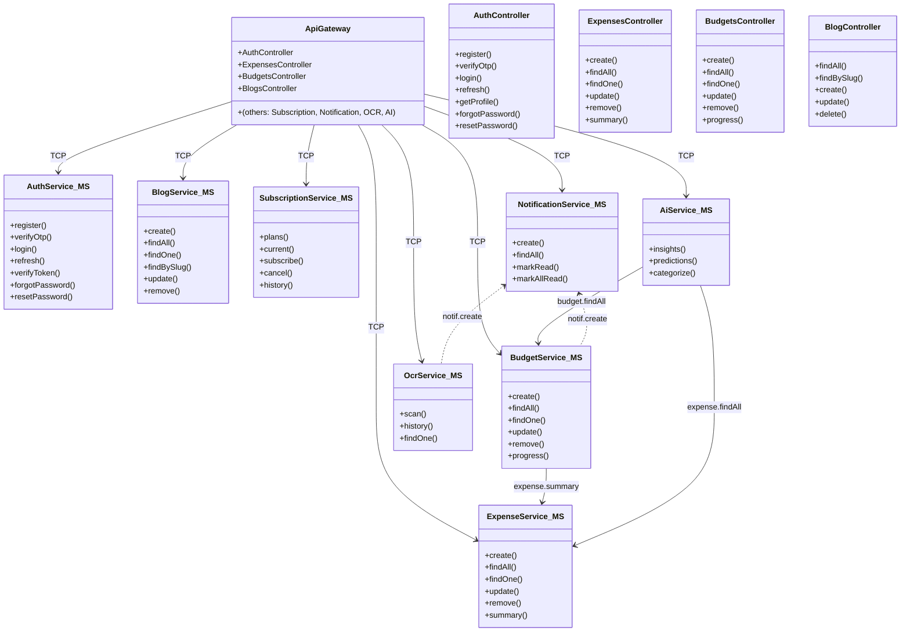
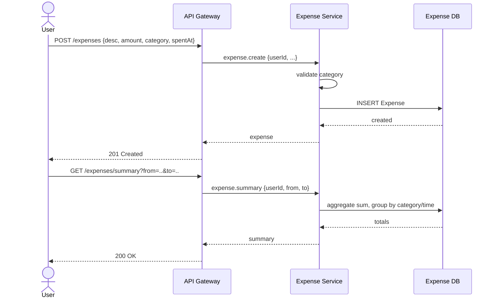
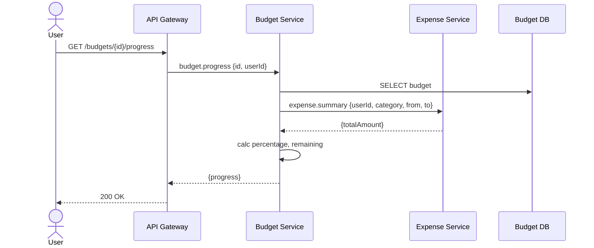
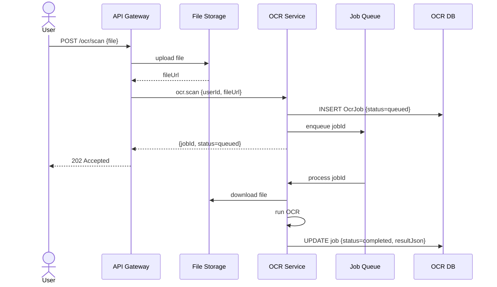
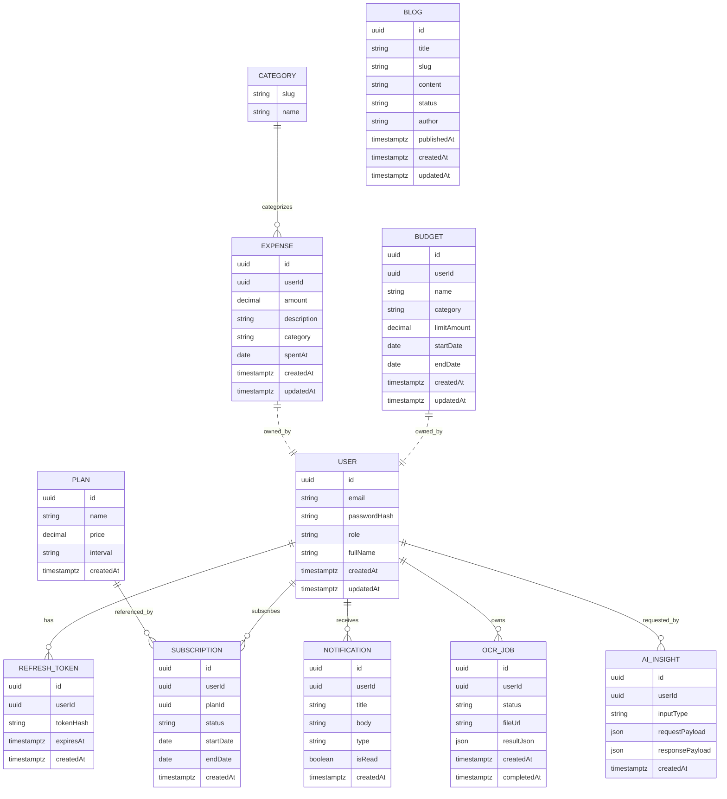

# FEPA - System Diagrams

Tài liệu tập trung vào các sơ đồ kiến trúc, quan hệ và luồng chính của hệ thống FEPA.

## 1. System Architecture (Microservices)

### 0. Context Diagram (C4 Level 1)



### 0b. Product Overview (Value & Channels)



## 1b. Use Case Diagram (Overview)

```mermaid
graph LR
  %% Orientation: actors on the left, domains spread horizontally

  %% Actors
  Guest((Guest))
  User((User))
  Admin((Admin))
  System((System))

  %% Auth
  subgraph AUTH[Authentication]
    UC_REG[Đăng ký tài khoản mới]
    UC_VERIFY[Xác thực OTP email]
    UC_LOGIN[Đăng nhập]
    UC_REFRESH[Làm mới phiên]
    UC_PROFILE[Xem hồ sơ cá nhân]
    UC_FORGOT[Yêu cầu đặt lại mật khẩu]
    UC_RESET[Đặt lại mật khẩu bằng OTP]
  end

  %% Expense
  subgraph EXP[Expenses]
    UC_EXP_CREATE[Thêm khoản chi]
    UC_EXP_LIST[Xem danh sách chi tiêu]
    UC_EXP_DETAIL[Xem chi tiết khoản chi]
    UC_EXP_UPDATE[Cập nhật khoản chi]
    UC_EXP_DELETE[Xóa khoản chi]
    UC_EXP_SUM[Tổng hợp chi tiêu]
    UC_EXP_CAT[Xem danh mục chi tiêu]
  end

  %% Budget
  subgraph BUD[Budgets]
    UC_BUD_CREATE[Tạo ngân sách]
    UC_BUD_LIST[Xem danh sách ngân sách]
    UC_BUD_DETAIL[Xem chi tiết ngân sách]
    UC_BUD_UPDATE[Chỉnh sửa ngân sách]
    UC_BUD_DELETE[Xóa ngân sách]
    UC_BUD_PROGRESS[Theo dõi tiến độ ngân sách]
  end

  %% Subscription
  subgraph SUBS[Subscriptions]
    UC_SUB_PLANS[Xem các gói dịch vụ]
    UC_SUB_CURRENT[Xem gói hiện tại]
    UC_SUB_SUB[Đăng ký gói]
    UC_SUB_CANCEL[Hủy gói]
    UC_SUB_HISTORY[Xem lịch sử thanh toán]
  end

  %% Blog/CMS
  subgraph BLOG[Blog / CMS]
    UC_BLOG_LIST[Đọc danh sách bài viết]
    UC_BLOG_DETAIL[Đọc chi tiết bài viết]
    UC_BLOG_CREATE[Tạo bài viết mới]
    UC_BLOG_UPDATE[Cập nhật bài viết]
    UC_BLOG_DELETE[Xóa bài viết]
  end

  %% OCR
  subgraph OCR[OCR]
    UC_OCR_SCAN[Quét hóa đơn]
    UC_OCR_HISTORY[Xem lịch sử quét]
    UC_OCR_DETAIL[Xem kết quả OCR]
  end

  %% AI Insights
  subgraph AI[AI Insights]
    UC_AI_INSIGHTS[Nhận phân tích chi tiêu]
    UC_AI_PRED[Nhận dự đoán chi tiêu]
    UC_AI_CAT[Đề xuất phân loại tự động]
  end

  %% Notifications
  subgraph NOTIF[Notifications]
    UC_NOTIF_LIST[Xem thông báo]
    UC_NOTIF_READ[Đánh dấu đã đọc]
    UC_NOTIF_READALL[Đánh dấu tất cả đã đọc]
    UC_NOTIF_CREATE[Tạo thông báo hệ thống]
  end

  %% Actor to use case links
  Guest --> UC_REG
  Guest --> UC_LOGIN
  Guest --> UC_FORGOT
  Guest --> UC_BLOG_LIST
  Guest --> UC_BLOG_DETAIL
  Guest --> UC_SUB_PLANS
  Guest --> UC_EXP_CAT

  User --> UC_VERIFY
  User --> UC_REFRESH
  User --> UC_PROFILE
  User --> UC_RESET

  User --> UC_EXP_CREATE
  User --> UC_EXP_LIST
  User --> UC_EXP_DETAIL
  User --> UC_EXP_UPDATE
  User --> UC_EXP_DELETE
  User --> UC_EXP_SUM
  User --> UC_EXP_CAT

  User --> UC_BUD_CREATE
  User --> UC_BUD_LIST
  User --> UC_BUD_DETAIL
  User --> UC_BUD_UPDATE
  User --> UC_BUD_DELETE
  User --> UC_BUD_PROGRESS

  User --> UC_SUB_CURRENT
  User --> UC_SUB_SUB
  User --> UC_SUB_CANCEL
  User --> UC_SUB_HISTORY

  User --> UC_OCR_SCAN
  User --> UC_OCR_HISTORY
  User --> UC_OCR_DETAIL

  User --> UC_AI_INSIGHTS
  User --> UC_AI_PRED
  User --> UC_AI_CAT

  User --> UC_NOTIF_LIST
  User --> UC_NOTIF_READ
  User --> UC_NOTIF_READALL

  Admin --> UC_BLOG_CREATE
  Admin --> UC_BLOG_UPDATE
  Admin --> UC_BLOG_DELETE
  Admin --> UC_PROFILE

  System --> UC_NOTIF_CREATE

  %% Internal relationships (optional includes/extensions)
  UC_REG -.-> UC_VERIFY
  UC_FORGOT -.-> UC_RESET
  UC_BUD_PROGRESS -.-> UC_EXP_SUM
  UC_AI_INSIGHTS -.-> UC_EXP_SUM
  UC_AI_INSIGHTS -.-> UC_BUD_LIST
  UC_AI_PRED -.-> UC_EXP_SUM
  UC_AI_CAT -.-> UC_EXP_LIST
```



```mermaid
graph TB
    Client[Client (Web/Mobile)]
    Gateway[API Gateway :3000]

    Auth[Auth Service :3001]
    Expense[Expense Service :3002]
    Budget[Budget Service :3003]
    Blog[Blog Service :3004]
    Sub[Subscription Service :3005]
    Notif[Notification Service :3006]
    OCR[OCR Service :3007]
    AI[AI Service :3008]

    DB_Auth[(Auth DB)]
    DB_Expense[(Expense DB)]
    DB_Budget[(Budget DB)]
    DB_Blog[(Blog DB)]
    DB_Sub[(Subscription DB)]
    DB_Notif[(Notification DB)]
    DB_OCR[(OCR DB)]
    DB_AI[(AI DB)]

    Client -->|HTTP/REST| Gateway
    Gateway -->|TCP| Auth
    Gateway -->|TCP| Expense
    Gateway -->|TCP| Budget
    Gateway -->|TCP| Blog
    Gateway -->|TCP| Sub
    Gateway -->|TCP| Notif
    Gateway -->|TCP| OCR
    Gateway -->|TCP| AI

    Auth --> DB_Auth
    Expense --> DB_Expense
    Budget --> DB_Budget
    Blog --> DB_Blog
    Sub --> DB_Sub
    Notif --> DB_Notif
    OCR --> DB_OCR
    AI --> DB_AI

    Budget -.->|alerts| Notif
    OCR -.->|job done| Notif
    AI -.->|insights| Notif
    Budget -.->|spend data| Expense
    AI -.->|data| Expense
    AI -.->|data| Budget
```

## 2. High-Level Class Diagram (Gateway + Services)



## 3. Key Sequence Diagrams

### 3.1. User Registration + OTP Verification

```mermaid
sequenceDiagram
    actor Guest
    participant Gateway as API Gateway
    participant Auth as Auth Service
    participant Email as Email Service
    participant DB as Auth DB

    Guest->>Gateway: POST /auth/register {email, pw, fullName}
    Gateway->>Auth: auth.register
    Auth->>DB: check email
    Auth->>Auth: hash pw, generate+hash OTP
    Auth->>DB: create user {isVerified=false, otpHash, otpExpiredAt}
    Auth->>Email: send OTP
    Auth-->>Gateway: {message: "OTP sent"}
    Gateway-->>Guest: 200 OK

    Guest->>Gateway: POST /auth/verify-otp {email, otp}
    Gateway->>Auth: auth.verifyOtp
    Auth->>DB: get user+otp
    Auth->>Auth: verify OTP & expiry
    Auth->>DB: update isVerified=true; create RefreshToken
    Auth-->>Gateway: {accessToken, refreshToken}
    Gateway-->>Guest: 200 OK
```

### 3.2. Create Expense + Summary



### 3.3. Budget Progress (cross-service)



### 3.4. OCR Scan (async)



## 4. Entity-Relationship Diagram (ERD)



## 5. Ghi chú

- Kiến trúc theo mô hình microservices, giao tiếp TCP qua NestJS `ClientProxy`.
- Mỗi service sở hữu database riêng (PostgreSQL cho Prisma services, MongoDB cho `auth-service` legacy).
- Flow cross-service chính: `budget.progress` gọi `expense.summary`; AI tổng hợp dữ liệu từ Expense/Budget; Notification nhận trigger từ Budget/OCR/AI.

**Last updated**: December 19, 2025
