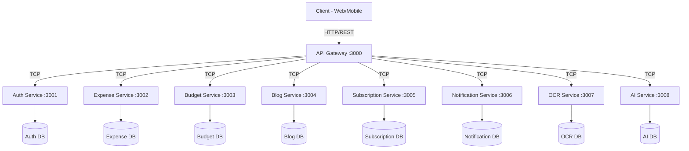
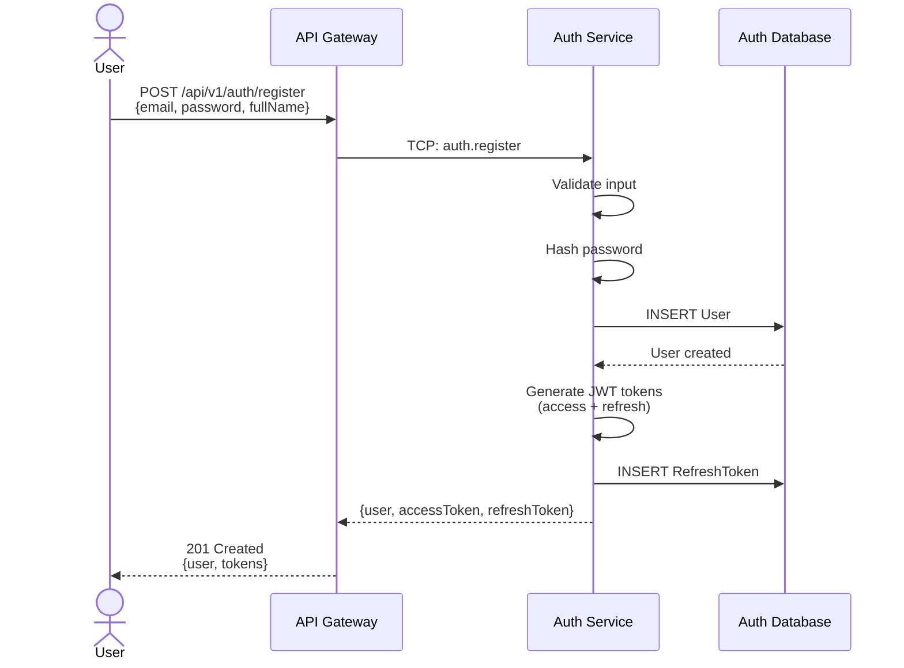
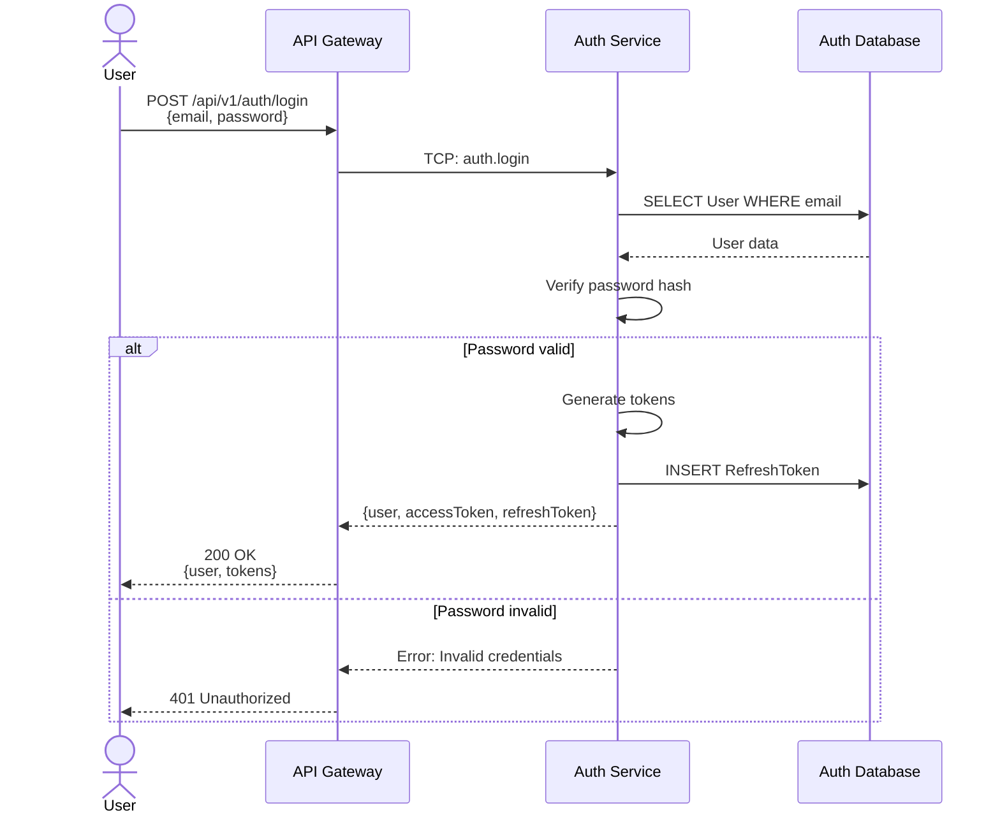
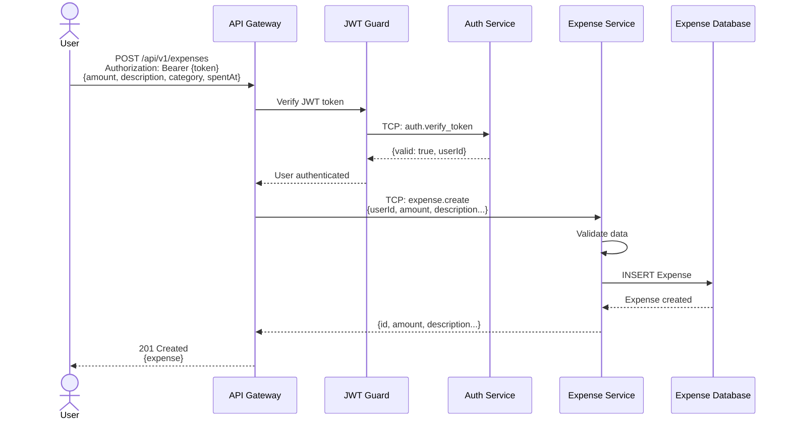
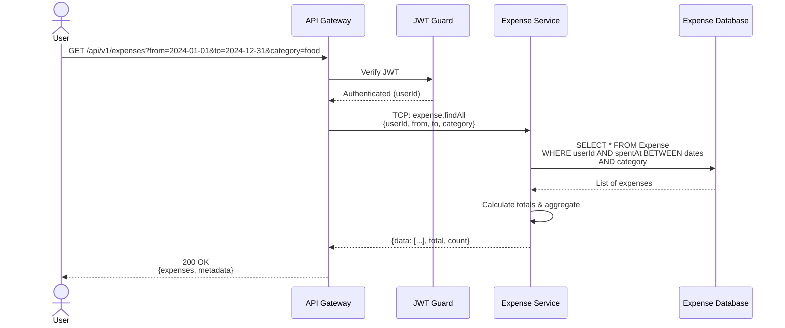
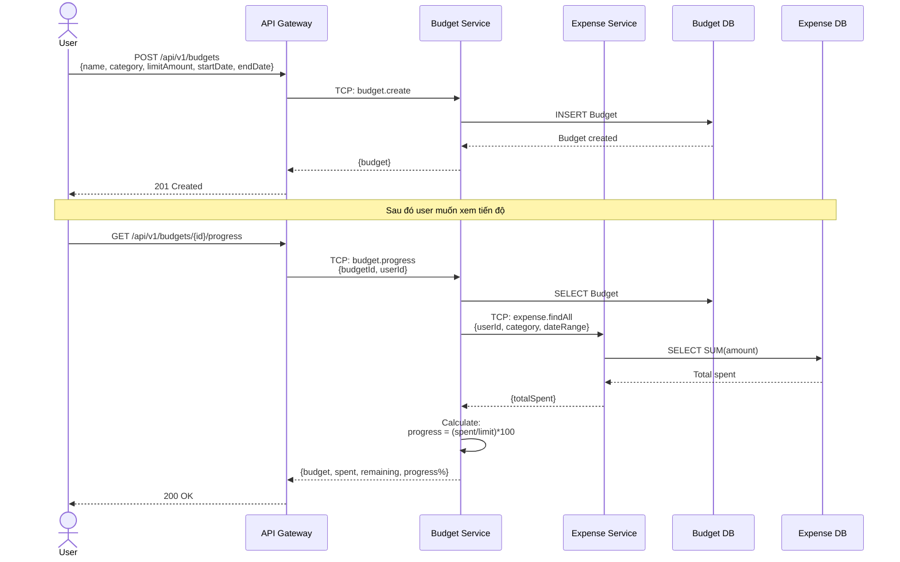
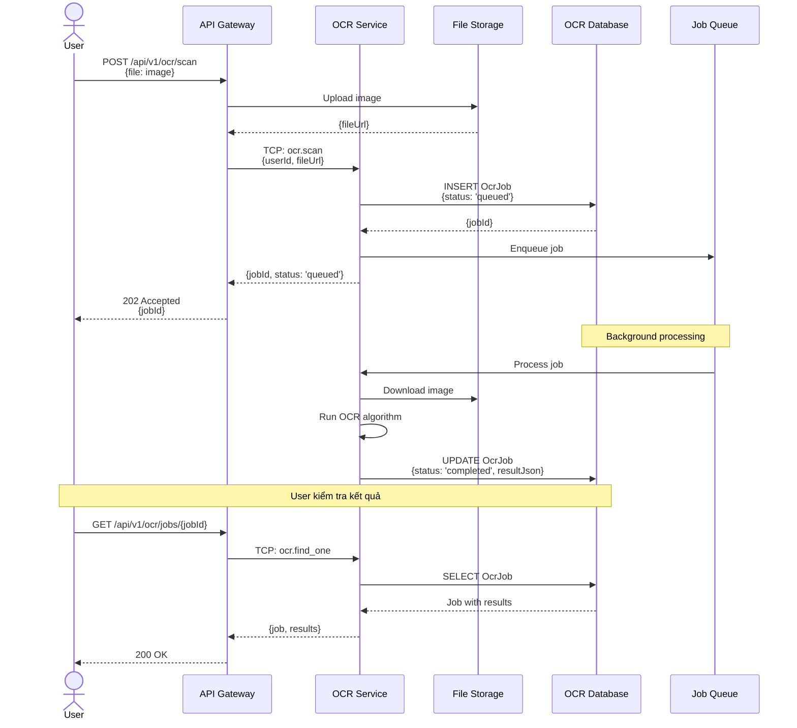
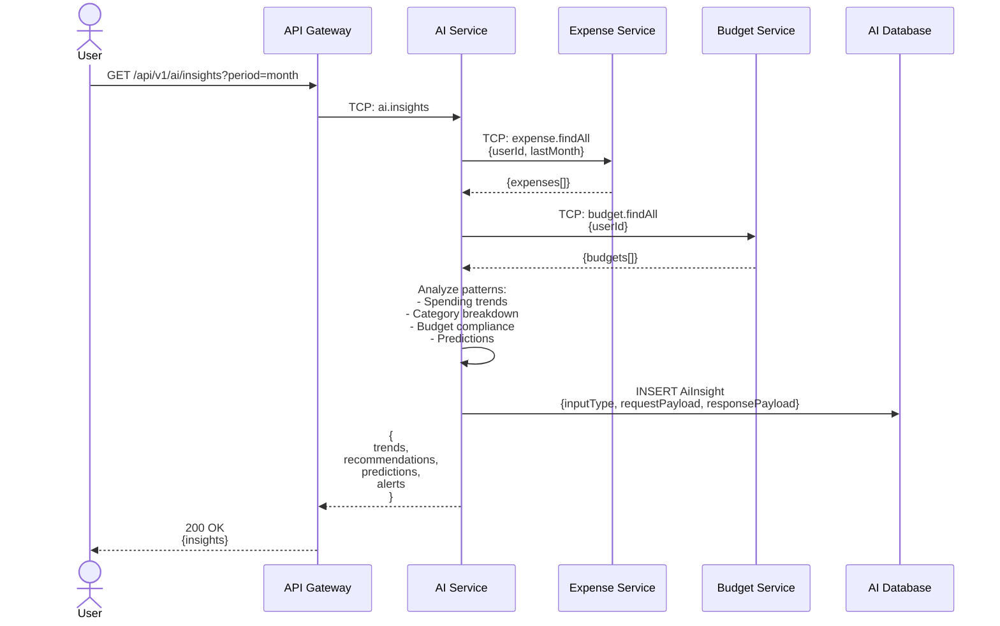
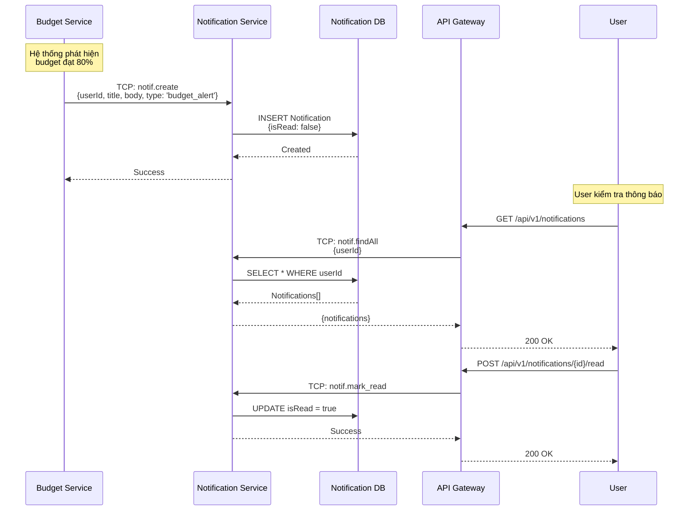

# FEPA - Project Documentation

## 1. Tổng Quan Dự Án

**FEPA** (Financial Expense & Planning Assistant) là một hệ thống microservices được thiết kế để quản lý tài chính cá nhân, bao gồm theo dõi chi tiêu, lập ngân sách, viết blog, quản lý đăng ký dịch vụ, và sử dụng AI để phân tích dữ liệu.

Hệ thống được xây dựng trên nền tảng **Node.js** với framework **NestJS**, sử dụng **Prisma** làm ORM và **PostgreSQL** làm cơ sở dữ liệu. Kiến trúc microservices được triển khai bằng **Docker** và giao tiếp qua giao thức **TCP**.

## 2. Kiến Trúc Hệ Thống

### 2.1. Mô hình

Hệ thống tuân theo mô hình Microservices với một **API Gateway** đóng vai trò là điểm vào duy nhất (Entry Point) cho tất cả các yêu cầu từ client.

- **Client** (Web/Mobile) gửi HTTP Request đến **API Gateway**.
- **API Gateway** xác thực (nếu cần) và chuyển tiếp yêu cầu đến các **Microservices** tương ứng thông qua giao thức **TCP**.
- Các **Microservices** xử lý logic nghiệp vụ, truy xuất Database riêng biệt và trả về kết quả.

### 2.2. Sơ đồ tổng quan kiến trúc



### 2.3. Danh sách Services

| Service Name             | Port (Host) | Loại | Nhiệm vụ chính                              |
| :----------------------- | :---------- | :--- | :------------------------------------------ |
| **api-gateway**          | 3000        | HTTP | Routing, Authentication Guard, Swagger Docs |
| **auth-service**         | 3001        | TCP  | Quản lý User, Đăng ký, Đăng nhập, Token     |
| **expense-service**      | 3002        | TCP  | Quản lý khoản chi tiêu, danh mục (Category) |
| **budget-service**       | 3003        | TCP  | Quản lý ngân sách, hạn mức chi tiêu         |
| **blog-service**         | 3004        | TCP  | Quản lý bài viết blog, CMS                  |
| **subscription-service** | 3005        | TCP  | Quản lý các gói đăng ký định kỳ             |
| **notification-service** | 3006        | TCP  | Quản lý thông báo người dùng                |
| **ocr-service**          | 3007        | TCP  | Xử lý OCR (quét hóa đơn)                    |
| **ai-service**           | 3008        | TCP  | Phân tích dữ liệu, đưa ra gợi ý tài chính   |

## 3. Luồng Hoạt Động (Workflows)

### 3.1. Luồng Đăng Ký Người Dùng (User Registration)



### 3.2. Luồng Đăng Nhập (User Login)



### 3.3. Luồng Tạo Khoản Chi Tiêu (Create Expense)



### 3.4. Luồng Lấy Danh Sách Chi Tiêu với Bộ Lọc



### 3.5. Luồng Tạo Ngân Sách và Theo Dõi (Create Budget & Track)



### 3.6. Luồng OCR Xử Lý Hóa Đơn (OCR Processing)



### 3.7. Luồng AI Phân Tích và Gợi Ý (AI Insights)



### 3.8. Luồng Gửi Thông Báo (Notification Flow)



## 4. Chi Tiết Các Services

### 4.1. API Gateway (`api-gateway`)

- **Vai trò**: Cổng giao tiếp chính, chuyển đổi HTTP request sang TCP message.
- **Tech Stack**: NestJS, `@nestjs/microservices`, `@nestjs/jwt`, Swagger.
- **Modules hiện có**: `ExpensesModule`, `CategoriesModule`, `BlogsModule`.
- **Responsibilities**:
  - HTTP Request routing
  - JWT Authentication & Authorization
  - Rate limiting (planned)
  - Request validation
  - API Documentation (Swagger)
- **Lưu ý**: Module `Auth` hiện chưa được import trong `AppModule` mặc dù có cấu hình client `AUTH_SERVICE`.

### 4.2. Auth Service (`auth-service`)

- **Vai trò**: Xác thực và phân quyền người dùng.
- **Database Schema**:
  - `User`: Thông tin người dùng (email, passwordHash, role).
  - `RefreshToken`: Token làm mới phiên đăng nhập.
- **Message Patterns**:
  - `auth.register`: Đăng ký user mới
  - `auth.login`: Đăng nhập và nhận token
  - `auth.refresh`: Làm mới access token
  - `auth.verify_token`: Xác thực token (internal)
  - `auth.profile`: Lấy thông tin user

### 4.3. Expense Service (`expense-service`)

- **Vai trò**: Core domain, quản lý chi tiêu.
- **Database Schema**:
  - `Expense`: Khoản chi (amount, description, spentAt).
  - `Category`: Danh mục chi tiêu (slug, name).
- **Message Patterns**:
  - `expense.create`: Tạo khoản chi mới
  - `expense.findAll`: Lấy danh sách (có filter)
  - `expense.findOne`: Lấy chi tiết 1 khoản chi
  - `expense.update`: Cập nhật khoản chi
  - `expense.remove`: Xóa khoản chi
  - `expense.summary`: Báo cáo tổng hợp theo thời gian/category

### 4.4. Budget Service (`budget-service`)

- **Vai trò**: Lập kế hoạch ngân sách.
- **Database Schema**:
  - `Budget`: Ngân sách (limitAmount, startDate, endDate).
- **Message Patterns**:
  - `budget.create`: Tạo ngân sách
  - `budget.findAll`: Danh sách ngân sách
  - `budget.findOne`: Chi tiết ngân sách
  - `budget.update`: Cập nhật
  - `budget.delete`: Xóa
  - `budget.progress`: Tính toán tiến độ chi tiêu so với hạn mức

### 4.5. Blog Service (`blog-service`)

- **Vai trò**: Hệ thống tin tức/blog.
- **Database Schema**:
  - `Blog`: Bài viết (title, slug, content, status).
- **Message Patterns**:
  - `blog.findAll`: Danh sách bài viết (public)
  - `blog.findBySlug`: Chi tiết bài viết
  - `blog.create`: Tạo bài viết (admin)
  - `blog.update`: Cập nhật (admin)
  - `blog.delete`: Xóa (admin)

### 4.6. Subscription Service (`subscription-service`)

- **Vai trò**: Quản lý các khoản thanh toán định kỳ.
- **Database Schema**:
  - `Plan`: Gói dịch vụ (name, price, interval).
  - `Subscription`: Đăng ký của user (status, startDate).
- **Message Patterns**:
  - `sub.plans`: Lấy danh sách gói (public)
  - `sub.current`: Gói hiện tại của user
  - `sub.subscribe`: Đăng ký gói mới
  - `sub.cancel`: Hủy đăng ký
  - `sub.invoices`: Lịch sử thanh toán

### 4.7. Notification Service (`notification-service`)

- **Vai trò**: Thông báo hệ thống.
- **Database Schema**:
  - `Notification`: Thông báo (title, body, isRead).
- **Message Patterns**:
  - `notif.create`: Tạo thông báo mới (internal)
  - `notif.findAll`: Lấy danh sách thông báo
  - `notif.mark_read`: Đánh dấu đã đọc
  - `notif.mark_all_read`: Đánh dấu tất cả đã đọc

### 4.8. OCR Service (`ocr-service`)

- **Vai trò**: Xử lý hình ảnh hóa đơn.
- **Database Schema**:
  - `OcrJob`: Job xử lý ảnh (fileUrl, status, resultJson).
- **Message Patterns**:
  - `ocr.scan`: Tạo job OCR mới
  - `ocr.history`: Lịch sử các job
  - `ocr.find_one`: Chi tiết 1 job

### 4.9. AI Service (`ai-service`)

- **Vai trò**: Trí tuệ nhân tạo hỗ trợ.
- **Database Schema**:
  - `AiInsight`: Lịch sử phân tích (inputType, requestPayload, responsePayload).
- **Message Patterns**:
  - `ai.insights`: Lấy phân tích tài chính
  - `ai.predictions`: Dự đoán chi tiêu
  - `ai.categorize`: Phân loại khoản chi tự động

## 5. Database Design (Prisma Schemas)

Dưới đây là thiết kế cơ sở dữ liệu chi tiết cho từng service (PostgreSQL).

### Auth Service

```prisma
model User {
  id            String          @id @default(uuid()) @db.Uuid
  email         String          @unique
  passwordHash  String
  fullName      String?         @db.Text
  role          String          @default("user")
  createdAt     DateTime        @default(now()) @db.Timestamptz(6)
  updatedAt     DateTime        @updatedAt @db.Timestamptz(6)
  refreshTokens RefreshToken[]
}

model RefreshToken {
  id        String   @id @default(uuid()) @db.Uuid
  userId    String   @db.Uuid
  tokenHash String
  expiresAt DateTime @db.Timestamptz(6)
  createdAt DateTime @default(now()) @db.Timestamptz(6)
  user User @relation(fields: [userId], references: [id], onDelete: Cascade)
  @@index([userId])
}
```

### Expense Service

```prisma
model Expense {
  id          String   @id @default(uuid()) @db.Uuid
  userId      String   @db.Uuid
  description String
  amount      Decimal  @db.Decimal(14, 2)
  category    String?  @db.Text
  spentAt     DateTime @db.Date
  createdAt   DateTime @default(now()) @db.Timestamptz(6)
  updatedAt   DateTime @updatedAt @db.Timestamptz(6)
  @@index([userId, spentAt])
}

model Category {
  slug String @id
  name String
}
```

### Budget Service

```prisma
model Budget {
  id          String    @id @default(uuid()) @db.Uuid
  userId      String    @db.Uuid
  name        String
  category    String?   @db.Text
  limitAmount Decimal   @db.Decimal(14, 2)
  startDate   DateTime? @db.Date
  endDate     DateTime? @db.Date
  createdAt   DateTime  @default(now()) @db.Timestamptz(6)
  updatedAt   DateTime  @updatedAt @db.Timestamptz(6)
  @@index([userId, category])
}
```

### Blog Service

```prisma
model Blog {
  id          String    @id @default(uuid()) @db.Uuid
  title       String
  slug        String    @unique
  content     String    @db.Text
  status      String    @default("published")
  author      String?   @db.Text
  publishedAt DateTime?
  createdAt   DateTime  @default(now()) @db.Timestamptz(6)
  updatedAt   DateTime  @updatedAt @db.Timestamptz(6)
}
```

### Subscription Service

```prisma
model Plan {
  id        String   @id @default(uuid()) @db.Uuid
  name      String
  price     Decimal  @db.Decimal(14, 2)
  interval  String
  createdAt DateTime @default(now()) @db.Timestamptz(6)
  subscriptions Subscription[]
}

model Subscription {
  id        String    @id @default(uuid()) @db.Uuid
  userId    String    @db.Uuid
  planId    String    @db.Uuid
  status    String    @default("active")
  startDate DateTime  @db.Date
  endDate   DateTime? @db.Date
  createdAt DateTime  @default(now()) @db.Timestamptz(6)
  plan Plan @relation(fields: [planId], references: [id], onDelete: Cascade)
  @@index([userId, status])
}
```

### Notification Service

```prisma
model Notification {
  id        String   @id @default(uuid()) @db.Uuid
  userId    String   @db.Uuid
  title     String
  body      String   @db.Text
  type      String?  @db.Text
  isRead    Boolean  @default(false)
  createdAt DateTime @default(now()) @db.Timestamptz(6)
  @@index([userId, isRead])
}
```

### OCR Service

```prisma
model OcrJob {
  id          String    @id @default(uuid()) @db.Uuid
  userId      String    @db.Uuid
  status      String    @default("queued")
  fileUrl     String
  resultJson  Json?
  createdAt   DateTime  @default(now()) @db.Timestamptz(6)
  completedAt DateTime? @db.Timestamptz(6)
  @@index([userId, status])
}
```

### AI Service

```prisma
model AiInsight {
  id              String   @id @default(uuid()) @db.Uuid
  userId          String   @db.Uuid
  inputType       String
  requestPayload  Json
  responsePayload Json
  createdAt       DateTime @default(now()) @db.Timestamptz(6)
  @@index([userId, inputType])
}
```

_(Chi tiết đầy đủ tham khảo file [DATABASE.md](DATABASE.md))_

## 6. API Endpoints

Các endpoint được expose qua **API Gateway** (Port 3000).

### Auth

- `POST /api/v1/auth/register`: Đăng ký
- `POST /api/v1/auth/login`: Đăng nhập
- `POST /api/v1/auth/refresh`: Làm mới token
- `GET /api/v1/auth/me`: Lấy thông tin user hiện tại

### Expenses

- `GET /api/v1/expenses`: Lấy danh sách chi tiêu (có filter: from, to, category, pagination)
- `POST /api/v1/expenses`: Tạo khoản chi mới
- `GET /api/v1/expenses/:id`: Chi tiết khoản chi
- `PUT /api/v1/expenses/:id`: Cập nhật khoản chi
- `DELETE /api/v1/expenses/:id`: Xóa khoản chi
- `GET /api/v1/expenses/summary`: Lấy báo cáo tổng hợp
- `GET /api/v1/expenses/categories`: Danh sách danh mục (public)

### Budgets

- `GET /api/v1/budgets`: Lấy danh sách ngân sách
- `POST /api/v1/budgets`: Tạo ngân sách mới
- `GET /api/v1/budgets/:id`: Chi tiết ngân sách
- `PUT /api/v1/budgets/:id`: Cập nhật ngân sách
- `DELETE /api/v1/budgets/:id`: Xóa ngân sách
- `GET /api/v1/budgets/:id/progress`: Theo dõi tiến độ

### Blogs

- `GET /api/v1/blogs`: Danh sách bài viết (Public)
- `GET /api/v1/blogs/:slug`: Chi tiết bài viết
- `POST /api/v1/blogs`: Tạo bài viết (Admin)
- `PUT /api/v1/blogs/:id`: Cập nhật bài viết (Admin)
- `DELETE /api/v1/blogs/:id`: Xóa bài viết (Admin)

### Subscriptions

- `GET /api/v1/subscriptions/plans`: Danh sách gói (Public)
- `GET /api/v1/subscriptions/current`: Gói hiện tại của user
- `POST /api/v1/subscriptions`: Đăng ký gói mới
- `POST /api/v1/subscriptions/cancel`: Hủy đăng ký
- `GET /api/v1/subscriptions/history`: Lịch sử

### Notifications

- `GET /api/v1/notifications`: Danh sách thông báo
- `POST /api/v1/notifications/:id/read`: Đánh dấu đã đọc
- `POST /api/v1/notifications/read-all`: Đánh dấu tất cả

### OCR

- `POST /api/v1/ocr/scan`: Quét hóa đơn
- `GET /api/v1/ocr/jobs`: Lịch sử các job
- `GET /api/v1/ocr/jobs/:jobId`: Chi tiết job

### AI

- `GET /api/v1/ai/insights`: Lấy phân tích tài chính
- `POST /api/v1/ai/insights`: Tạo insight mới
- `GET /api/v1/ai/predictions`: Dự đoán chi tiêu
- `POST /api/v1/ai/categorize`: Phân loại tự động

_(Chi tiết đầy đủ tham khảo file [ARCHITECTURE.md](ARCHITECTURE.md))_

## 7. Hướng Dẫn Cài Đặt & Chạy

### 7.1. Yêu cầu

- Docker & Docker Compose
- Node.js 18+ (cho development local)
- PostgreSQL (nếu chạy local không dùng Docker)

### 7.2. Chạy toàn bộ hệ thống với Docker

Sử dụng Docker Compose để khởi chạy tất cả services:

```bash
cd deployment

# Windows: chạy setup.bat để kiểm tra môi trường và build
setup.bat

# Linux/Mac: chạy setup.sh
chmod +x setup.sh
./setup.sh

# Hoặc chạy trực tiếp:
docker-compose up -d
```

### 7.3. Kiểm tra trạng thái

- **API Gateway Health Check**: `http://localhost:3000/api/v1/health`
- **Swagger Documentation**: `http://localhost:3000/docs`
- **Kiểm tra logs**:
  ```bash
  docker-compose logs -f api-gateway
  docker-compose logs -f auth-service
  ```

### 7.4. Development (Local)

Để chạy từng service ở môi trường dev:

1. Vào thư mục service (ví dụ `api-gateway`).
2. Cài đặt dependencies: `npm install`.
3. Thiết lập `.env` với database connection.
4. Chạy Prisma migrations (nếu có): `npx prisma migrate dev`.
5. Chạy service: `npm run start:dev`.

### 7.5. Dừng Services

```bash
docker-compose down

# Xóa cả volumes (database data):
docker-compose down -v
```

## 8. Cấu Trúc Thư Mục

```
FEPA/
├── api-gateway/              # HTTP Entry point
│   ├── src/
│   │   ├── app.module.ts
│   │   ├── main.ts
│   │   ├── common/           # Guards, Decorators, Strategies
│   │   ├── config/           # Configuration files
│   │   ├── expenses/         # Expense module (proxy)
│   │   ├── categories/       # Category module
│   │   └── blogs/            # Blog module
│   ├── Dockerfile
│   └── package.json
│
├── auth-service/             # Authentication Microservice
│   ├── prisma/
│   │   └── schema.prisma     # User, RefreshToken models
│   ├── src/
│   │   ├── app.controller.ts
│   │   ├── app.service.ts
│   │   └── prisma/           # Prisma service
│   ├── Dockerfile
│   └── package.json
│
├── expense-service/          # Expense Management Microservice
│   ├── prisma/
│   │   └── schema.prisma     # Expense, Category models
│   ├── src/
│   ├── Dockerfile
│   ├── docker-compose.yml    # Local dev compose
│   ├── README.md
│   └── package.json
│
├── budget-service/           # Budget Management Microservice
├── blog-service/             # Blog/CMS Microservice
├── subscription-service/     # Subscription Microservice
├── notification-service/     # Notification Microservice
├── ocr-service/              # OCR Processing Microservice
├── ai-service/               # AI Insights Microservice
│
└── deployment/               # Docker config, Docs, Scripts
    ├── docker-compose.yml    # Production compose
    ├── .env.example
    ├── setup.bat             # Windows setup script
    ├── setup.sh              # Linux/Mac setup script
    ├── health-check.bat
    ├── health-check.sh
    ├── ARCHITECTURE.md       # API Routes mapping
    ├── DATABASE.md           # Database schemas detail
    ├── DEPLOYMENT.md         # Deployment guide
    ├── README.md             # Quick start guide
    └── PROJECT_DOCUMENTATION.md  # This file
```

## 9. Best Practices & Patterns

### 9.1. Communication Pattern

- **Synchronous**: API Gateway ↔ Services qua TCP
- **Database per Service**: Mỗi service có DB riêng
- **Message Pattern**: `{cmd: 'domain.action'}` format

### 9.2. Security

- JWT-based authentication
- Password hashing (bcrypt)
- Request validation với `class-validator`
- CORS configuration
- Helmet.js cho security headers

### 9.3. Error Handling

- Consistent error response format
- HTTP status codes mapping
- Logging với structured logs

### 9.4. Testing

- Unit tests: Jest
- E2E tests: Supertest
- Test coverage tracking

## 10. Roadmap & Future Enhancements

- [ ] Implement Redis caching layer
- [ ] Add Message Queue (RabbitMQ/Kafka) for async operations
- [ ] Implement Event-Driven Architecture
- [ ] Add API rate limiting
- [ ] Implement Circuit Breaker pattern
- [ ] Add monitoring (Prometheus + Grafana)
- [ ] Add distributed tracing (Jaeger)
- [ ] Implement CQRS pattern for reporting
- [ ] Add WebSocket support for real-time notifications
- [ ] Mobile app integration (React Native)
- [ ] Multi-language support (i18n)

## 11. Troubleshooting

### Service không khởi động

1. Kiểm tra logs: `docker-compose logs [service-name]`
2. Kiểm tra port conflicts
3. Verify environment variables

### Database connection errors

1. Kiểm tra `DATABASE_URL` trong `.env`
2. Chạy Prisma migrations: `npx prisma migrate dev`
3. Verify database container đã running

### TCP connection timeout

1. Verify service dependencies trong `docker-compose.yml`
2. Check network configuration
3. Ensure services started in correct order

## 12. Contributing

Khi phát triển tính năng mới:

1. Tạo branch mới từ `main`
2. Implement feature với tests
3. Update documentation
4. Submit Pull Request
5. Code review & merge

## 13. License

Private project - All rights reserved.

---

**Tài liệu được cập nhật**: December 17, 2025
**Version**: 1.0.0
