# FEPA - Use Cases Documentation

## Mục Lục

1. [Tổng Quan Use Cases](#1-tổng-quan-use-cases)
2. [Use Case Diagram Tổng Quát](#2-use-case-diagram-tổng-quát)
3. [Use Cases Chi Tiết Theo Module](#3-use-cases-chi-tiết-theo-module)
   - [3.1. Authentication Module](#31-authentication-module)
   - [3.2. Expense Management Module](#32-expense-management-module)
   - [3.3. Budget Management Module](#33-budget-management-module)
   - [3.4. Blog/CMS Module](#34-blogcms-module)
   - [3.5. Subscription Module](#35-subscription-module)
   - [3.6. Notification Module](#36-notification-module)
   - [3.7. OCR Module](#37-ocr-module)
   - [3.8. AI Insights Module](#38-ai-insights-module)
4. [Ma Trận Actor - Use Case](#4-ma-trận-actor---use-case)
5. [Use Case Specifications](#5-use-case-specifications)

---

## 1. Tổng Quan Use Cases

FEPA (Financial Expense & Planning Assistant) là hệ thống quản lý tài chính cá nhân với các nhóm chức năng chính:

| Module                 | Mô tả                           | Actors             |
| ---------------------- | ------------------------------- | ------------------ |
| **Authentication**     | Xác thực, phân quyền người dùng | Guest, User, Admin |
| **Expense Management** | Quản lý các khoản chi tiêu      | User               |
| **Budget Management**  | Lập và theo dõi ngân sách       | User               |
| **Blog/CMS**           | Quản lý bài viết, tin tức       | Guest, Admin       |
| **Subscription**       | Quản lý gói đăng ký dịch vụ     | Guest, User        |
| **Notification**       | Hệ thống thông báo              | User, System       |
| **OCR**                | Quét và nhận diện hóa đơn       | User               |
| **AI Insights**        | Phân tích dữ liệu tài chính     | User               |

### Actors (Tác nhân)

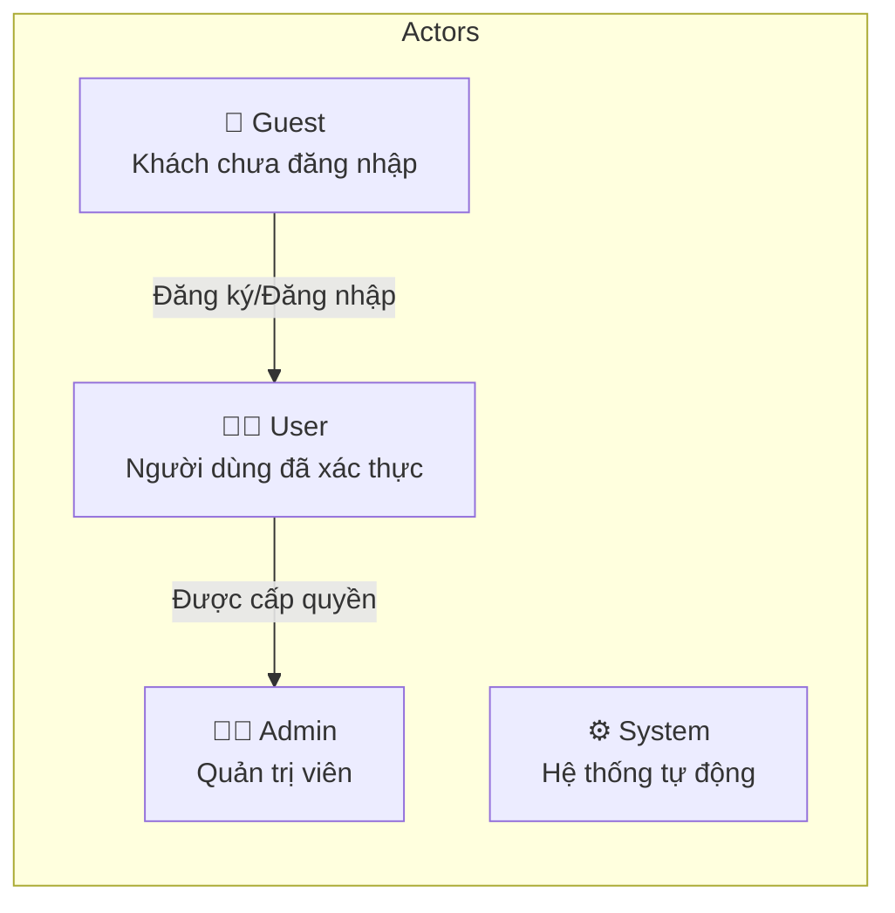
```mermaid
graph LR
    subgraph Actors
        Guest[👤 Guest<br/>Khách chưa đăng nhập]
        User[👨‍💼 User<br/>Người dùng đã xác thực]
        Admin[👨‍💻 Admin<br/>Quản trị viên]
        System[⚙️ System<br/>Hệ thống tự động]
    end

    Guest -->|Đăng ký/Đăng nhập| User
    User -->|Được cấp quyền| Admin
```

---

## 2. Use Case Diagram Tổng Quát


```mermaid
graph TB
    subgraph Actors
        Guest((Guest))
        User((User))
        Admin((Admin))
        System((System))
    end

    subgraph "Authentication Module"
        UC_REG[Đăng ký tài khoản]
        UC_VERIFY[Xác thực OTP]
        UC_LOGIN[Đăng nhập]
        UC_LOGOUT[Đăng xuất]
        UC_REFRESH[Làm mới token]
        UC_FORGOT[Quên mật khẩu]
        UC_RESET[Đặt lại mật khẩu]
        UC_PROFILE[Xem thông tin cá nhân]
    end

    subgraph "Expense Management Module"
        UC_CREATE_EXP[Tạo khoản chi]
        UC_VIEW_EXPS[Xem danh sách chi tiêu]
        UC_VIEW_EXP[Xem chi tiết khoản chi]
        UC_UPDATE_EXP[Cập nhật khoản chi]
        UC_DELETE_EXP[Xóa khoản chi]
        UC_SUMMARY[Xem báo cáo tổng hợp]
        UC_CATEGORIES[Xem danh mục chi tiêu]
    end

    subgraph "Budget Management Module"
        UC_CREATE_BUD[Tạo ngân sách]
        UC_VIEW_BUDS[Xem danh sách ngân sách]
        UC_VIEW_BUD[Xem chi tiết ngân sách]
        UC_UPDATE_BUD[Cập nhật ngân sách]
        UC_DELETE_BUD[Xóa ngân sách]
        UC_PROGRESS[Theo dõi tiến độ ngân sách]
    end

    subgraph "Blog/CMS Module"
        UC_VIEW_BLOGS[Xem danh sách bài viết]
        UC_VIEW_BLOG[Xem chi tiết bài viết]
        UC_CREATE_BLOG[Tạo bài viết]
        UC_UPDATE_BLOG[Cập nhật bài viết]
        UC_DELETE_BLOG[Xóa bài viết]
    end

    subgraph "Subscription Module"
        UC_VIEW_PLANS[Xem các gói dịch vụ]
        UC_VIEW_CURRENT[Xem gói hiện tại]
        UC_SUBSCRIBE[Đăng ký gói]
        UC_CANCEL_SUB[Hủy đăng ký]
        UC_VIEW_HISTORY[Xem lịch sử thanh toán]
    end

    subgraph "Notification Module"
        UC_VIEW_NOTIFS[Xem thông báo]
        UC_MARK_READ[Đánh dấu đã đọc]
        UC_MARK_ALL[Đánh dấu tất cả đã đọc]
        UC_CREATE_NOTIF[Tạo thông báo]
    end

    subgraph "OCR Module"
        UC_SCAN[Quét hóa đơn]
        UC_VIEW_JOBS[Xem lịch sử quét]
        UC_VIEW_JOB[Xem chi tiết job OCR]
    end

    subgraph "AI Insights Module"
        UC_GET_INSIGHTS[Lấy phân tích tài chính]
        UC_PREDICTIONS[Xem dự đoán chi tiêu]
        UC_CATEGORIZE[Phân loại tự động]
    end

    %% Guest connections
    Guest --> UC_REG
    Guest --> UC_LOGIN
    Guest --> UC_FORGOT
    Guest --> UC_VIEW_BLOGS
    Guest --> UC_VIEW_BLOG
    Guest --> UC_VIEW_PLANS
    Guest --> UC_CATEGORIES

    %% User connections
    User --> UC_VERIFY
    User --> UC_LOGOUT
    User --> UC_REFRESH
    User --> UC_RESET
    User --> UC_PROFILE

    User --> UC_CREATE_EXP
    User --> UC_VIEW_EXPS
    User --> UC_VIEW_EXP
    User --> UC_UPDATE_EXP
    User --> UC_DELETE_EXP
    User --> UC_SUMMARY

    User --> UC_CREATE_BUD
    User --> UC_VIEW_BUDS
    User --> UC_VIEW_BUD
    User --> UC_UPDATE_BUD
    User --> UC_DELETE_BUD
    User --> UC_PROGRESS

    User --> UC_VIEW_CURRENT
    User --> UC_SUBSCRIBE
    User --> UC_CANCEL_SUB
    User --> UC_VIEW_HISTORY

    User --> UC_VIEW_NOTIFS
    User --> UC_MARK_READ
    User --> UC_MARK_ALL

    User --> UC_SCAN
    User --> UC_VIEW_JOBS
    User --> UC_VIEW_JOB

    User --> UC_GET_INSIGHTS
    User --> UC_PREDICTIONS
    User --> UC_CATEGORIZE

    %% Admin connections
    Admin --> UC_CREATE_BLOG
    Admin --> UC_UPDATE_BLOG
    Admin --> UC_DELETE_BLOG

    %% System connections
    System --> UC_CREATE_NOTIF
```

---

## 3. Use Cases Chi Tiết Theo Module

### 3.1. Authentication Module

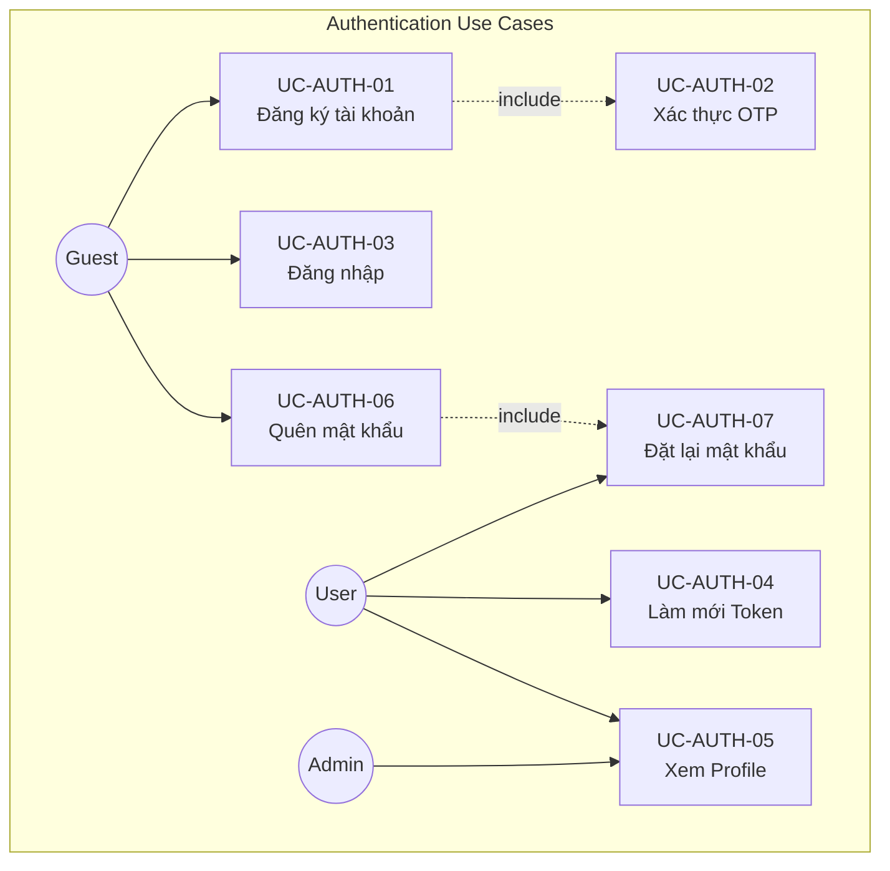
```mermaid
graph TB
    subgraph "Authentication Use Cases"
        Guest((Guest))
        User((User))
        Admin((Admin))

        UC1[UC-AUTH-01<br/>Đăng ký tài khoản]
        UC2[UC-AUTH-02<br/>Xác thực OTP]
        UC3[UC-AUTH-03<br/>Đăng nhập]
        UC4[UC-AUTH-04<br/>Làm mới Token]
        UC5[UC-AUTH-05<br/>Xem Profile]
        UC6[UC-AUTH-06<br/>Quên mật khẩu]
        UC7[UC-AUTH-07<br/>Đặt lại mật khẩu]

        Guest --> UC1
        Guest --> UC3
        Guest --> UC6

        UC1 -.->|include| UC2
        UC6 -.->|include| UC7

        User --> UC4
        User --> UC5
        User --> UC7

        Admin --> UC5
    end
```

#### UC-AUTH-01: Đăng ký tài khoản

| Thuộc tính          | Mô tả                                                        |
| ------------------- | ------------------------------------------------------------ |
| **ID**              | UC-AUTH-01                                                   |
| **Tên**             | Đăng ký tài khoản                                            |
| **Actor**           | Guest                                                        |
| **Mô tả**           | Người dùng mới đăng ký tài khoản vào hệ thống                |
| **Precondition**    | Email chưa tồn tại trong hệ thống                            |
| **Postcondition**   | OTP được gửi đến email, tài khoản ở trạng thái chưa xác thực |
| **API Endpoint**    | `POST /api/v1/auth/register`                                 |
| **Service Pattern** | `auth.register`                                              |

**Flow chính:**

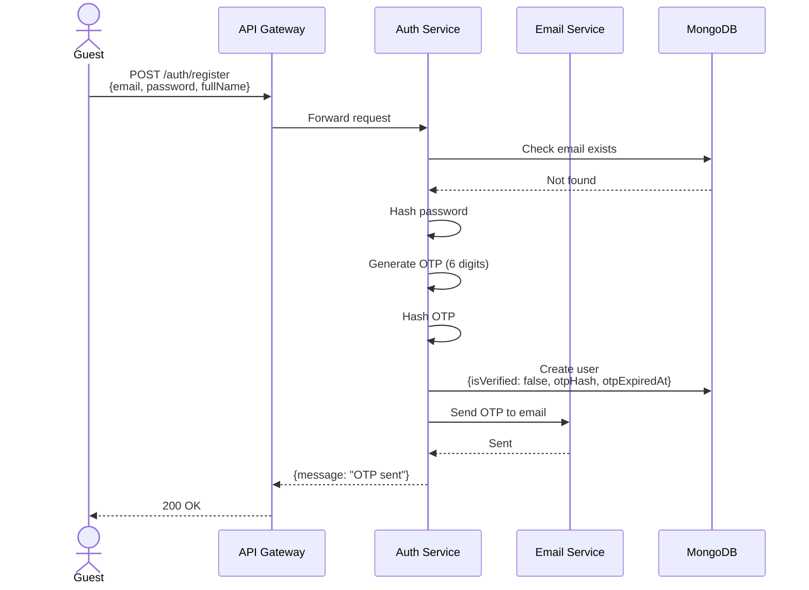
```mermaid
sequenceDiagram
    actor Guest
    participant Gateway as API Gateway
    participant Auth as Auth Service
    participant Email as Email Service
    participant DB as MongoDB

    Guest->>Gateway: POST /auth/register<br/>{email, password, fullName}
    Gateway->>Auth: Forward request
    Auth->>DB: Check email exists
    DB-->>Auth: Not found
    Auth->>Auth: Hash password
    Auth->>Auth: Generate OTP (6 digits)
    Auth->>Auth: Hash OTP
    Auth->>DB: Create user<br/>{isVerified: false, otpHash, otpExpiredAt}
    Auth->>Email: Send OTP to email
    Email-->>Auth: Sent
    Auth-->>Gateway: {message: "OTP sent"}
    Gateway-->>Guest: 200 OK
```

#### UC-AUTH-02: Xác thực OTP

| Thuộc tính          | Mô tả                                                      |
| ------------------- | ---------------------------------------------------------- |
| **ID**              | UC-AUTH-02                                                 |
| **Tên**             | Xác thực OTP                                               |
| **Actor**           | Guest (sau khi đăng ký)                                    |
| **Mô tả**           | Xác thực email bằng mã OTP                                 |
| **Precondition**    | Đã nhận được OTP qua email, OTP chưa hết hạn (5 phút)      |
| **Postcondition**   | Tài khoản được kích hoạt, nhận được access & refresh token |
| **API Endpoint**    | `POST /api/v1/auth/verify-otp`                             |
| **Service Pattern** | `auth.verifyOtp`                                           |

**Flow chính:**

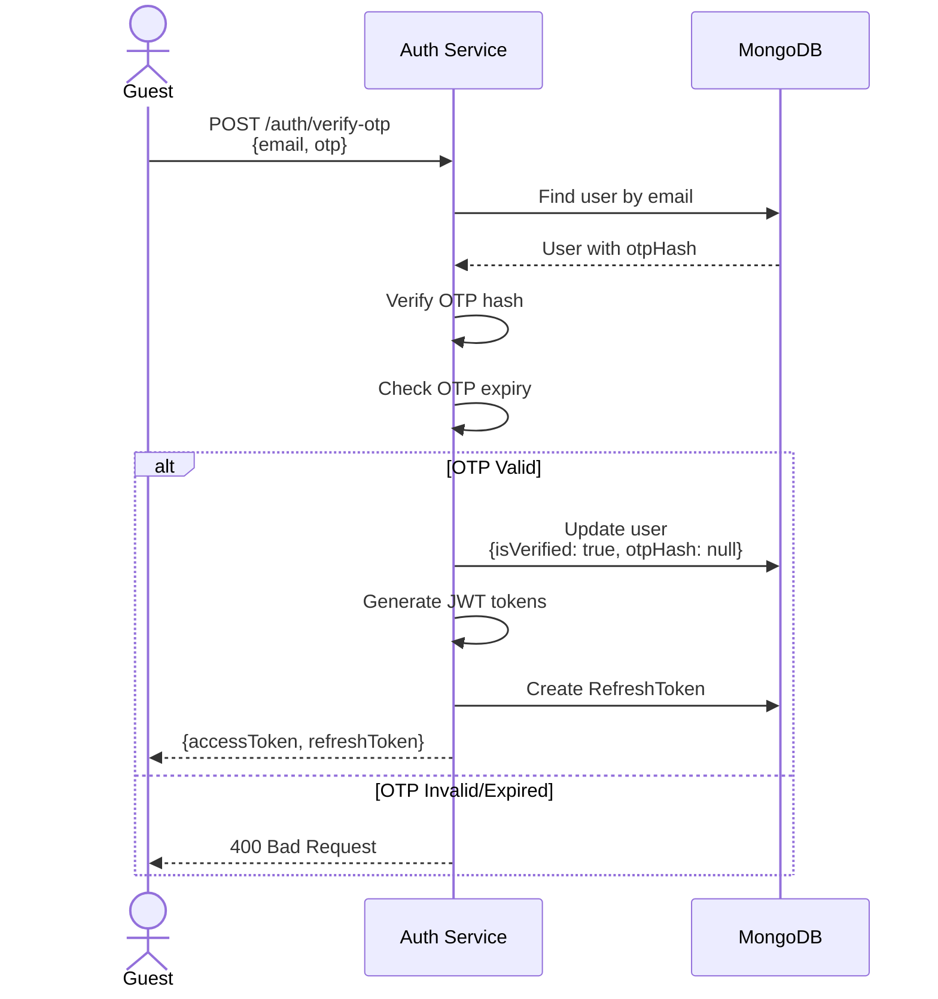
```mermaid
sequenceDiagram
    actor Guest
    participant Auth as Auth Service
    participant DB as MongoDB

    Guest->>Auth: POST /auth/verify-otp<br/>{email, otp}
    Auth->>DB: Find user by email
    DB-->>Auth: User with otpHash
    Auth->>Auth: Verify OTP hash
    Auth->>Auth: Check OTP expiry
    alt OTP Valid
        Auth->>DB: Update user<br/>{isVerified: true, otpHash: null}
        Auth->>Auth: Generate JWT tokens
        Auth->>DB: Create RefreshToken
        Auth-->>Guest: {accessToken, refreshToken}
    else OTP Invalid/Expired
        Auth-->>Guest: 400 Bad Request
    end
```

#### UC-AUTH-03: Đăng nhập

| Thuộc tính          | Mô tả                                          |
| ------------------- | ---------------------------------------------- |
| **ID**              | UC-AUTH-03                                     |
| **Tên**             | Đăng nhập                                      |
| **Actor**           | Guest                                          |
| **Mô tả**           | Đăng nhập vào hệ thống với email và password   |
| **Precondition**    | Tài khoản đã được xác thực (isVerified = true) |
| **Postcondition**   | Nhận được access & refresh token               |
| **API Endpoint**    | `POST /api/v1/auth/login`                      |
| **Service Pattern** | `auth.login`                                   |

**Flow chính:**

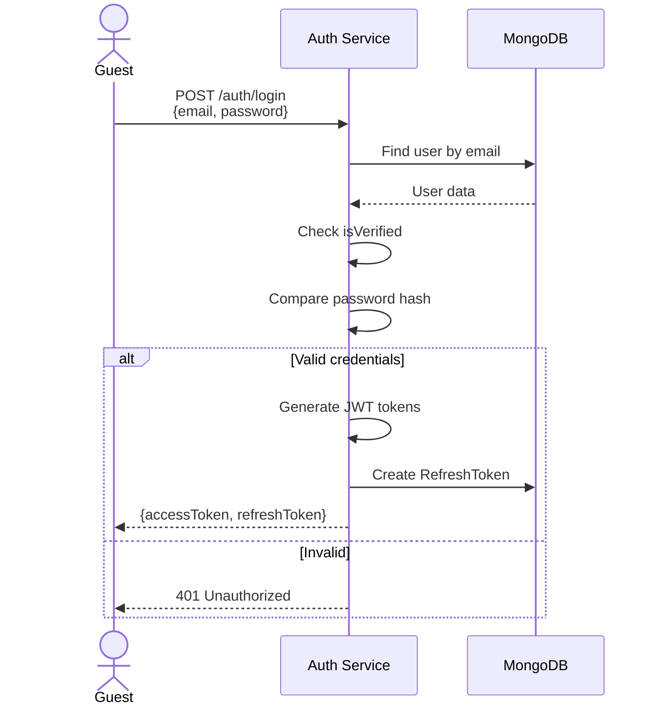
```mermaid
sequenceDiagram
    actor Guest
    participant Auth as Auth Service
    participant DB as MongoDB

    Guest->>Auth: POST /auth/login<br/>{email, password}
    Auth->>DB: Find user by email
    DB-->>Auth: User data
    Auth->>Auth: Check isVerified
    Auth->>Auth: Compare password hash
    alt Valid credentials
        Auth->>Auth: Generate JWT tokens
        Auth->>DB: Create RefreshToken
        Auth-->>Guest: {accessToken, refreshToken}
    else Invalid
        Auth-->>Guest: 401 Unauthorized
    end
```

#### UC-AUTH-04: Làm mới Token

| Thuộc tính          | Mô tả                                         |
| ------------------- | --------------------------------------------- |
| **ID**              | UC-AUTH-04                                    |
| **Tên**             | Làm mới Access Token                          |
| **Actor**           | User                                          |
| **Mô tả**           | Sử dụng refresh token để lấy access token mới |
| **Precondition**    | Refresh token hợp lệ và chưa hết hạn          |
| **Postcondition**   | Nhận được access token mới                    |
| **API Endpoint**    | `POST /api/v1/auth/refresh`                   |
| **Service Pattern** | `auth.refresh`                                |

#### UC-AUTH-05: Xem Profile

| Thuộc tính          | Mô tả                            |
| ------------------- | -------------------------------- |
| **ID**              | UC-AUTH-05                       |
| **Tên**             | Xem thông tin cá nhân            |
| **Actor**           | User, Admin                      |
| **Mô tả**           | Xem thông tin tài khoản của mình |
| **Precondition**    | Đã đăng nhập                     |
| **Postcondition**   | Hiển thị thông tin user          |
| **API Endpoint**    | `GET /api/v1/auth/me`            |
| **Service Pattern** | `auth.profile`                   |

#### UC-AUTH-06: Quên mật khẩu

| Thuộc tính          | Mô tả                               |
| ------------------- | ----------------------------------- |
| **ID**              | UC-AUTH-06                          |
| **Tên**             | Quên mật khẩu                       |
| **Actor**           | Guest                               |
| **Mô tả**           | Yêu cầu reset mật khẩu qua email    |
| **Precondition**    | Email tồn tại trong hệ thống        |
| **Postcondition**   | OTP được gửi đến email              |
| **API Endpoint**    | `POST /api/v1/auth/forgot-password` |
| **Service Pattern** | `auth.forgotPassword`               |

#### UC-AUTH-07: Đặt lại mật khẩu

| Thuộc tính          | Mô tả                              |
| ------------------- | ---------------------------------- |
| **ID**              | UC-AUTH-07                         |
| **Tên**             | Đặt lại mật khẩu                   |
| **Actor**           | Guest/User                         |
| **Mô tả**           | Đặt lại mật khẩu mới với OTP       |
| **Precondition**    | Có OTP hợp lệ từ forgot-password   |
| **Postcondition**   | Mật khẩu được cập nhật             |
| **API Endpoint**    | `POST /api/v1/auth/reset-password` |
| **Service Pattern** | `auth.resetPassword`               |

---

### 3.2. Expense Management Module

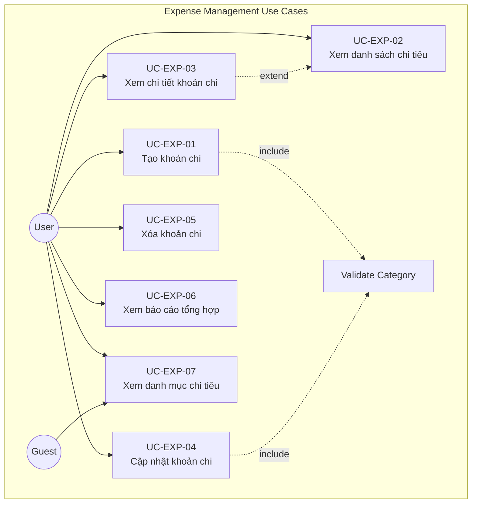
```mermaid
graph TB
    subgraph "Expense Management Use Cases"
        User((User))
        Guest((Guest))

        UC1[UC-EXP-01<br/>Tạo khoản chi]
        UC2[UC-EXP-02<br/>Xem danh sách chi tiêu]
        UC3[UC-EXP-03<br/>Xem chi tiết khoản chi]
        UC4[UC-EXP-04<br/>Cập nhật khoản chi]
        UC5[UC-EXP-05<br/>Xóa khoản chi]
        UC6[UC-EXP-06<br/>Xem báo cáo tổng hợp]
        UC7[UC-EXP-07<br/>Xem danh mục chi tiêu]

        User --> UC1
        User --> UC2
        User --> UC3
        User --> UC4
        User --> UC5
        User --> UC6
        User --> UC7

        Guest --> UC7

        UC1 -.->|include| UC_VALIDATE[Validate Category]
        UC4 -.->|include| UC_VALIDATE
        UC3 -.->|extend| UC2
    end
```

#### UC-EXP-01: Tạo khoản chi

| Thuộc tính          | Mô tả                                        |
| ------------------- | -------------------------------------------- |
| **ID**              | UC-EXP-01                                    |
| **Tên**             | Tạo khoản chi mới                            |
| **Actor**           | User                                         |
| **Mô tả**           | Người dùng thêm một khoản chi tiêu mới       |
| **Precondition**    | Đã đăng nhập, category (nếu có) phải tồn tại |
| **Postcondition**   | Khoản chi được lưu vào database              |
| **API Endpoint**    | `POST /api/v1/expenses`                      |
| **Service Pattern** | `expense.create`                             |

**Flow chính:**

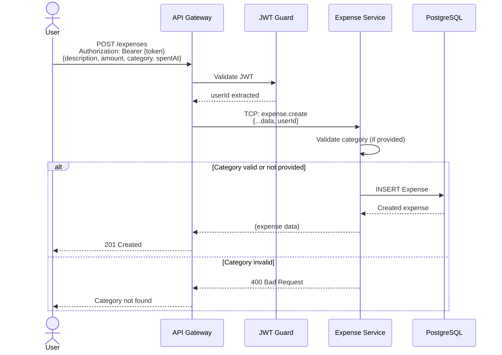
```mermaid
sequenceDiagram
    actor User
    participant Gateway as API Gateway
    participant Guard as JWT Guard
    participant Expense as Expense Service
    participant DB as PostgreSQL

    User->>Gateway: POST /expenses<br/>Authorization: Bearer {token}<br/>{description, amount, category, spentAt}
    Gateway->>Guard: Validate JWT
    Guard-->>Gateway: userId extracted
    Gateway->>Expense: TCP: expense.create<br/>{...data, userId}
    Expense->>Expense: Validate category (if provided)
    alt Category valid or not provided
        Expense->>DB: INSERT Expense
        DB-->>Expense: Created expense
        Expense-->>Gateway: {expense data}
        Gateway-->>User: 201 Created
    else Category invalid
        Expense-->>Gateway: 400 Bad Request
        Gateway-->>User: Category not found
    end
```

**Input:**

```typescript
{
  description: string;      // Mô tả khoản chi
  amount: number;           // Số tiền (Decimal 14,2)
  category?: string;        // Slug của category (optional)
  spentAt: string;          // Ngày chi tiêu (ISO date)
}
```

**Output:**

```typescript
{
  id: string; // UUID
  userId: string;
  description: string;
  amount: number;
  category: string | null;
  spentAt: string;
  createdAt: string;
  updatedAt: string;
}
```

#### UC-EXP-02: Xem danh sách chi tiêu

| Thuộc tính          | Mô tả                                    |
| ------------------- | ---------------------------------------- |
| **ID**              | UC-EXP-02                                |
| **Tên**             | Xem danh sách chi tiêu                   |
| **Actor**           | User                                     |
| **Mô tả**           | Xem tất cả khoản chi của mình với filter |
| **Precondition**    | Đã đăng nhập                             |
| **Postcondition**   | Hiển thị danh sách khoản chi             |
| **API Endpoint**    | `GET /api/v1/expenses`                   |
| **Service Pattern** | `expense.findAll`                        |

**Query Parameters:**

```typescript
{
  from?: string;        // Lọc từ ngày (YYYY-MM-DD)
  to?: string;          // Lọc đến ngày (YYYY-MM-DD)
  category?: string;    // Lọc theo category slug
  page?: number;        // Trang (default: 1)
  limit?: number;       // Số item mỗi trang (default: 10)
}
```

**Response:**

```typescript
{
  data: Expense[];
  meta: {
    total: number;
    page: number;
    limit: number;
    totalPages: number;
    timestamp: string;
  }
}
```

#### UC-EXP-03: Xem chi tiết khoản chi

| Thuộc tính          | Mô tả                                |
| ------------------- | ------------------------------------ |
| **ID**              | UC-EXP-03                            |
| **Tên**             | Xem chi tiết khoản chi               |
| **Actor**           | User                                 |
| **Mô tả**           | Xem thông tin chi tiết một khoản chi |
| **Precondition**    | Đã đăng nhập, expense thuộc về user  |
| **Postcondition**   | Hiển thị chi tiết khoản chi          |
| **API Endpoint**    | `GET /api/v1/expenses/:id`           |
| **Service Pattern** | `expense.findOne`                    |

#### UC-EXP-04: Cập nhật khoản chi

| Thuộc tính          | Mô tả                               |
| ------------------- | ----------------------------------- |
| **ID**              | UC-EXP-04                           |
| **Tên**             | Cập nhật khoản chi                  |
| **Actor**           | User                                |
| **Mô tả**           | Sửa thông tin một khoản chi         |
| **Precondition**    | Đã đăng nhập, expense thuộc về user |
| **Postcondition**   | Khoản chi được cập nhật             |
| **API Endpoint**    | `PATCH /api/v1/expenses/:id`        |
| **Service Pattern** | `expense.update`                    |

#### UC-EXP-05: Xóa khoản chi

| Thuộc tính          | Mô tả                               |
| ------------------- | ----------------------------------- |
| **ID**              | UC-EXP-05                           |
| **Tên**             | Xóa khoản chi                       |
| **Actor**           | User                                |
| **Mô tả**           | Xóa một khoản chi                   |
| **Precondition**    | Đã đăng nhập, expense thuộc về user |
| **Postcondition**   | Khoản chi bị xóa khỏi database      |
| **API Endpoint**    | `DELETE /api/v1/expenses/:id`       |
| **Service Pattern** | `expense.remove`                    |

#### UC-EXP-06: Xem báo cáo tổng hợp

| Thuộc tính          | Mô tả                                            |
| ------------------- | ------------------------------------------------ |
| **ID**              | UC-EXP-06                                        |
| **Tên**             | Xem báo cáo tổng hợp chi tiêu                    |
| **Actor**           | User                                             |
| **Mô tả**           | Xem thống kê tổng hợp theo thời gian và category |
| **Precondition**    | Đã đăng nhập                                     |
| **Postcondition**   | Hiển thị báo cáo tổng hợp                        |
| **API Endpoint**    | `GET /api/v1/expenses/summary`                   |
| **Service Pattern** | `expense.summary`                                |

**Query Parameters:**

```typescript
{
  from?: string;            // Từ ngày
  to?: string;              // Đến ngày
  groupBy?: 'day' | 'week' | 'month' | 'year';  // Nhóm theo
}
```

**Response:**

```typescript
{
  total: number;                    // Tổng chi tiêu
  count: number;                    // Số khoản chi
  byCategory: [{
    category: string;
    total: number;
    count: number;
  }];
  byTimePeriod?: [{                // Nếu có groupBy
    period: string;
    total: number;
    count: number;
  }];
}
```

#### UC-EXP-07: Xem danh mục chi tiêu

| Thuộc tính          | Mô tả                                      |
| ------------------- | ------------------------------------------ |
| **ID**              | UC-EXP-07                                  |
| **Tên**             | Xem danh mục chi tiêu                      |
| **Actor**           | Guest, User                                |
| **Mô tả**           | Xem danh sách các danh mục chi tiêu có sẵn |
| **Precondition**    | Không                                      |
| **Postcondition**   | Hiển thị danh sách categories              |
| **API Endpoint**    | `GET /api/v1/expenses/categories`          |
| **Service Pattern** | `expense.categories`                       |

---

### 3.3. Budget Management Module

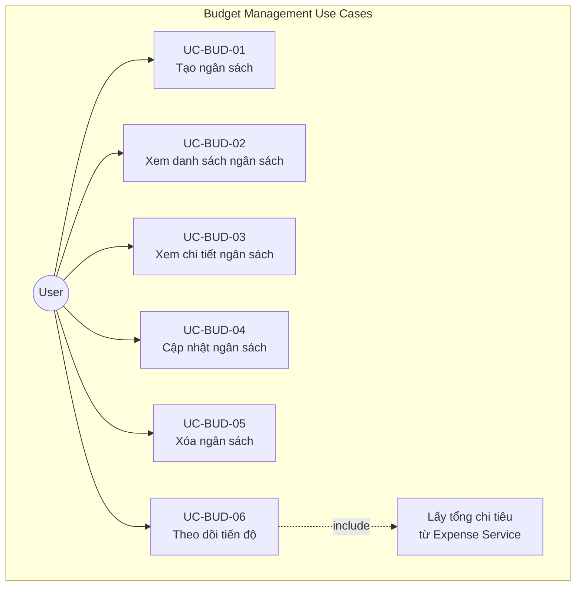
```mermaid
graph TB
    subgraph "Budget Management Use Cases"
        User((User))

        UC1[UC-BUD-01<br/>Tạo ngân sách]
        UC2[UC-BUD-02<br/>Xem danh sách ngân sách]
        UC3[UC-BUD-03<br/>Xem chi tiết ngân sách]
        UC4[UC-BUD-04<br/>Cập nhật ngân sách]
        UC5[UC-BUD-05<br/>Xóa ngân sách]
        UC6[UC-BUD-06<br/>Theo dõi tiến độ]

        User --> UC1
        User --> UC2
        User --> UC3
        User --> UC4
        User --> UC5
        User --> UC6

        UC6 -.->|include| UC_GET_EXP[Lấy tổng chi tiêu<br/>từ Expense Service]
    end
```

#### UC-BUD-01: Tạo ngân sách

| Thuộc tính          | Mô tả                                               |
| ------------------- | --------------------------------------------------- |
| **ID**              | UC-BUD-01                                           |
| **Tên**             | Tạo ngân sách mới                                   |
| **Actor**           | User                                                |
| **Mô tả**           | Người dùng tạo ngân sách cho một category/thời gian |
| **Precondition**    | Đã đăng nhập                                        |
| **Postcondition**   | Ngân sách được tạo                                  |
| **API Endpoint**    | `POST /api/v1/budgets`                              |
| **Service Pattern** | `budget.create`                                     |

**Input:**

```typescript
{
  name: string;             // Tên ngân sách
  category?: string;        // Category slug (optional)
  limitAmount: number;      // Hạn mức
  startDate?: string;       // Ngày bắt đầu
  endDate?: string;         // Ngày kết thúc
}
```

#### UC-BUD-06: Theo dõi tiến độ

| Thuộc tính          | Mô tả                                      |
| ------------------- | ------------------------------------------ |
| **ID**              | UC-BUD-06                                  |
| **Tên**             | Theo dõi tiến độ ngân sách                 |
| **Actor**           | User                                       |
| **Mô tả**           | Xem tổng chi tiêu so với hạn mức ngân sách |
| **Precondition**    | Đã đăng nhập, ngân sách tồn tại            |
| **Postcondition**   | Hiển thị progress                          |
| **API Endpoint**    | `GET /api/v1/budgets/:id/progress`         |
| **Service Pattern** | `budget.progress`                          |

**Flow (Cross-service communication):**

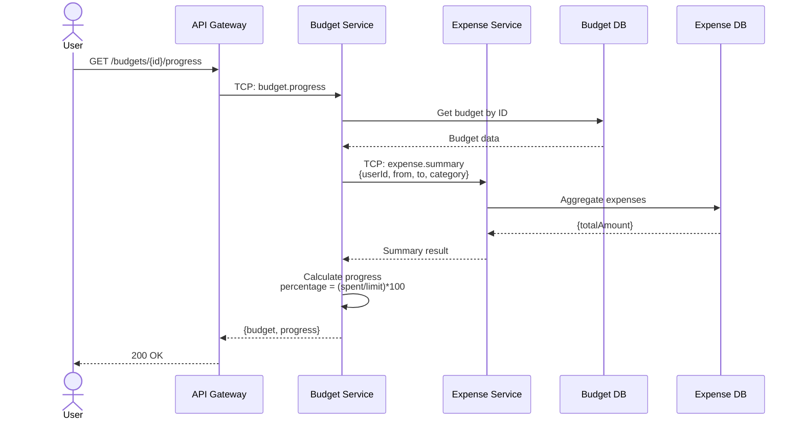
```mermaid
sequenceDiagram
    actor User
    participant Gateway as API Gateway
    participant Budget as Budget Service
    participant Expense as Expense Service
    participant BudgetDB as Budget DB
    participant ExpenseDB as Expense DB

    User->>Gateway: GET /budgets/{id}/progress
    Gateway->>Budget: TCP: budget.progress
    Budget->>BudgetDB: Get budget by ID
    BudgetDB-->>Budget: Budget data
    Budget->>Expense: TCP: expense.summary<br/>{userId, from, to, category}
    Expense->>ExpenseDB: Aggregate expenses
    ExpenseDB-->>Expense: {totalAmount}
    Expense-->>Budget: Summary result
    Budget->>Budget: Calculate progress<br/>percentage = (spent/limit)*100
    Budget-->>Gateway: {budget, progress}
    Gateway-->>User: 200 OK
```

**Response:**

```typescript
{
  id: string;
  name: string;
  category: string | null;
  limitAmount: number;
  startDate: string | null;
  endDate: string | null;
  progress: {
    totalSpent: number;
    remaining: number;
    percentage: number; // 0-100+
    status: "SAFE" | "EXCEEDED";
  }
}
```

---

### 3.4. Blog/CMS Module

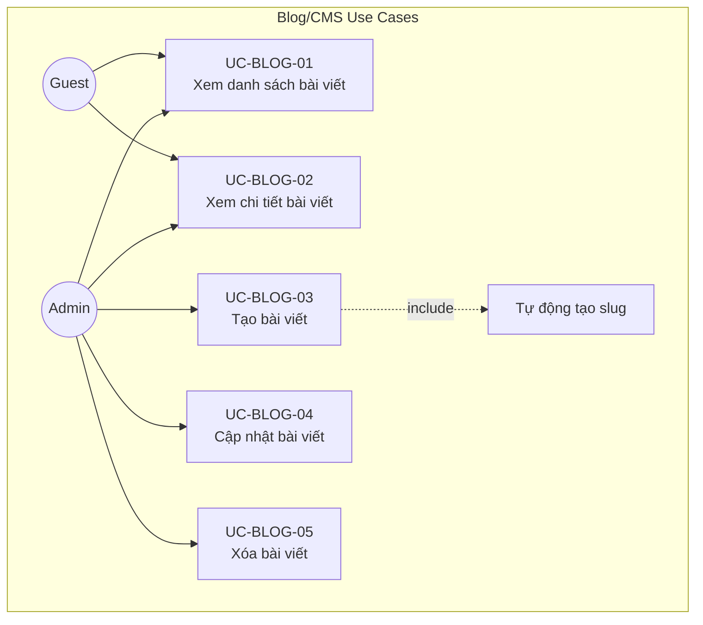
```mermaid
graph TB
    subgraph "Blog/CMS Use Cases"
        Guest((Guest))
        Admin((Admin))

        UC1[UC-BLOG-01<br/>Xem danh sách bài viết]
        UC2[UC-BLOG-02<br/>Xem chi tiết bài viết]
        UC3[UC-BLOG-03<br/>Tạo bài viết]
        UC4[UC-BLOG-04<br/>Cập nhật bài viết]
        UC5[UC-BLOG-05<br/>Xóa bài viết]

        Guest --> UC1
        Guest --> UC2

        Admin --> UC1
        Admin --> UC2
        Admin --> UC3
        Admin --> UC4
        Admin --> UC5

        UC3 -.->|include| UC_GEN_SLUG[Tự động tạo slug]
    end
```

#### UC-BLOG-01: Xem danh sách bài viết

| Thuộc tính          | Mô tả                           |
| ------------------- | ------------------------------- |
| **ID**              | UC-BLOG-01                      |
| **Tên**             | Xem danh sách bài viết          |
| **Actor**           | Guest, Admin                    |
| **Mô tả**           | Xem danh sách các bài viết blog |
| **Precondition**    | Không                           |
| **Postcondition**   | Hiển thị danh sách bài viết     |
| **API Endpoint**    | `GET /api/v1/blogs`             |
| **Service Pattern** | `blog.find_all`                 |

**Query Parameters:**

```typescript
{
  status?: string;      // Lọc theo status (published, draft)
  page?: number;
  limit?: number;
}
```

#### UC-BLOG-02: Xem chi tiết bài viết

| Thuộc tính          | Mô tả                            |
| ------------------- | -------------------------------- |
| **ID**              | UC-BLOG-02                       |
| **Tên**             | Xem chi tiết bài viết            |
| **Actor**           | Guest, Admin                     |
| **Mô tả**           | Xem nội dung đầy đủ một bài viết |
| **Precondition**    | Bài viết tồn tại                 |
| **Postcondition**   | Hiển thị nội dung bài viết       |
| **API Endpoint**    | `GET /api/v1/blogs/:slug`        |
| **Service Pattern** | `blog.find_by_slug`              |

#### UC-BLOG-03: Tạo bài viết (Admin)

| Thuộc tính          | Mô tả                       |
| ------------------- | --------------------------- |
| **ID**              | UC-BLOG-03                  |
| **Tên**             | Tạo bài viết mới            |
| **Actor**           | Admin                       |
| **Mô tả**           | Admin tạo bài viết blog mới |
| **Precondition**    | Đã đăng nhập với role ADMIN |
| **Postcondition**   | Bài viết được tạo           |
| **API Endpoint**    | `POST /api/v1/blogs`        |
| **Service Pattern** | `blog.create`               |

**Input:**

```typescript
{
  title: string;
  slug: string;
  content: string;
  status?: string;      // 'published' | 'draft' (default: 'published')
  author?: string;
  publishedAt?: string;
}
```

---

### 3.5. Subscription Module

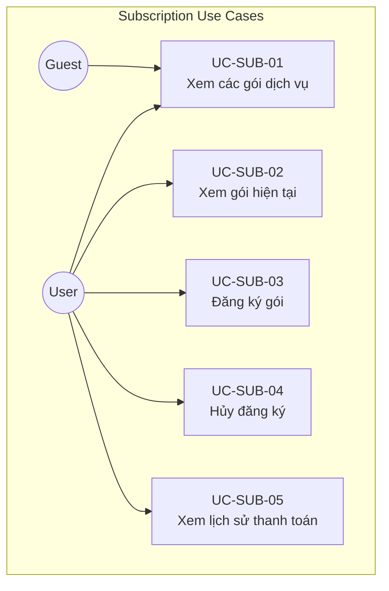
```mermaid
graph TB
    subgraph "Subscription Use Cases"
        Guest((Guest))
        User((User))

        UC1[UC-SUB-01<br/>Xem các gói dịch vụ]
        UC2[UC-SUB-02<br/>Xem gói hiện tại]
        UC3[UC-SUB-03<br/>Đăng ký gói]
        UC4[UC-SUB-04<br/>Hủy đăng ký]
        UC5[UC-SUB-05<br/>Xem lịch sử thanh toán]

        Guest --> UC1

        User --> UC1
        User --> UC2
        User --> UC3
        User --> UC4
        User --> UC5
    end
```

#### UC-SUB-01: Xem các gói dịch vụ

| Thuộc tính          | Mô tả                             |
| ------------------- | --------------------------------- |
| **ID**              | UC-SUB-01                         |
| **Tên**             | Xem danh sách gói dịch vụ         |
| **Actor**           | Guest, User                       |
| **Mô tả**           | Xem các gói subscription có sẵn   |
| **Precondition**    | Không                             |
| **Postcondition**   | Hiển thị danh sách Plans          |
| **API Endpoint**    | `GET /api/v1/subscriptions/plans` |
| **Service Pattern** | `sub.plans`                       |

**Response:**

```typescript
[{
  id: string;
  name: string;
  price: number;
  interval: string;     // 'monthly' | 'yearly'
  createdAt: string;
}]
```

#### UC-SUB-03: Đăng ký gói

| Thuộc tính          | Mô tả                        |
| ------------------- | ---------------------------- |
| **ID**              | UC-SUB-03                    |
| **Tên**             | Đăng ký gói mới              |
| **Actor**           | User                         |
| **Mô tả**           | User đăng ký một gói dịch vụ |
| **Precondition**    | Đã đăng nhập, Plan tồn tại   |
| **Postcondition**   | Subscription được tạo        |
| **API Endpoint**    | `POST /api/v1/subscriptions` |
| **Service Pattern** | `sub.subscribe`              |

---

### 3.6. Notification Module

```mermaid
graph TB
    subgraph "Notification Use Cases"
        User((User))
        System((System))

        UC1[UC-NOTIF-01<br/>Xem thông báo]
        UC2[UC-NOTIF-02<br/>Đánh dấu đã đọc]
        UC3[UC-NOTIF-03<br/>Đánh dấu tất cả đã đọc]
        UC4[UC-NOTIF-04<br/>Tạo thông báo<br/>(Internal)]

        User --> UC1
        User --> UC2
        User --> UC3

        System --> UC4

        UC4 -.->|trigger| BUDGET_ALERT[Budget Alert<br/>Khi vượt 80%]
        UC4 -.->|trigger| OCR_COMPLETE[OCR Complete<br/>Khi xử lý xong]
    end
```

#### UC-NOTIF-01: Xem thông báo

| Thuộc tính          | Mô tả                         |
| ------------------- | ----------------------------- |
| **ID**              | UC-NOTIF-01                   |
| **Tên**             | Xem danh sách thông báo       |
| **Actor**           | User                          |
| **Mô tả**           | Xem tất cả thông báo của mình |
| **Precondition**    | Đã đăng nhập                  |
| **Postcondition**   | Hiển thị danh sách thông báo  |
| **API Endpoint**    | `GET /api/v1/notifications`   |
| **Service Pattern** | `notif.find_all`              |

**Query Parameters:**

```typescript
{
  unreadOnly?: boolean;     // Chỉ lấy chưa đọc
}
```

#### UC-NOTIF-04: Tạo thông báo (Internal)

| Thuộc tính          | Mô tả                                   |
| ------------------- | --------------------------------------- |
| **ID**              | UC-NOTIF-04                             |
| **Tên**             | Tạo thông báo (Internal)                |
| **Actor**           | System                                  |
| **Mô tả**           | Hệ thống tự động tạo thông báo cho user |
| **Trigger**         | Budget vượt hạn mức, OCR hoàn tất, etc. |
| **Service Pattern** | `notif.create`                          |

**System Notification Flow:**

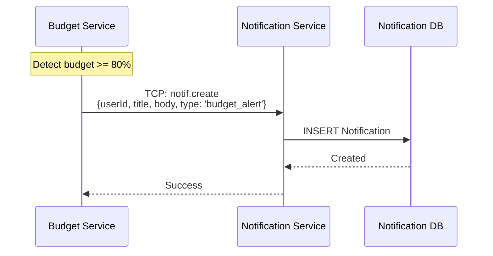
```mermaid
sequenceDiagram
    participant Budget as Budget Service
    participant Notif as Notification Service
    participant DB as Notification DB

    Note over Budget: Detect budget >= 80%
    Budget->>Notif: TCP: notif.create<br/>{userId, title, body, type: 'budget_alert'}
    Notif->>DB: INSERT Notification
    DB-->>Notif: Created
    Notif-->>Budget: Success
```

---

### 3.7. OCR Module

```mermaid
graph TB
    subgraph "OCR Use Cases"
        User((User))
        System((System))

        UC1[UC-OCR-01<br/>Quét hóa đơn]
        UC2[UC-OCR-02<br/>Xem lịch sử quét]
        UC3[UC-OCR-03<br/>Xem chi tiết job]
        UC4[UC-OCR-04<br/>Xử lý OCR<br/>(Background)]

        User --> UC1
        User --> UC2
        User --> UC3

        UC1 -.->|trigger| UC4
        System --> UC4
    end
```

#### UC-OCR-01: Quét hóa đơn

| Thuộc tính          | Mô tả                                      |
| ------------------- | ------------------------------------------ |
| **ID**              | UC-OCR-01                                  |
| **Tên**             | Quét hóa đơn                               |
| **Actor**           | User                                       |
| **Mô tả**           | Upload ảnh hóa đơn để trích xuất thông tin |
| **Precondition**    | Đã đăng nhập                               |
| **Postcondition**   | OCR job được tạo, trạng thái 'queued'      |
| **API Endpoint**    | `POST /api/v1/ocr/scan`                    |
| **Service Pattern** | `ocr.scan`                                 |

**Flow:**

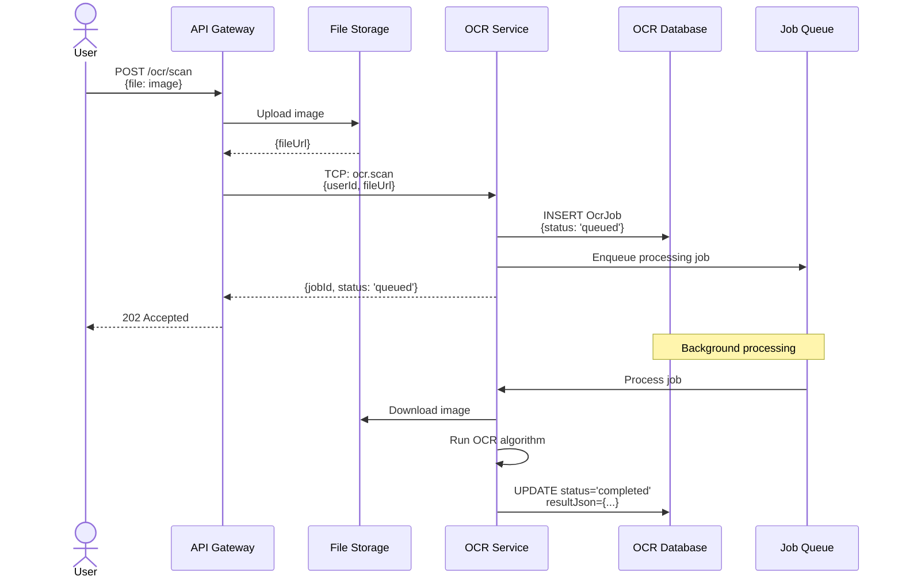
```mermaid
sequenceDiagram
    actor User
    participant Gateway as API Gateway
    participant Storage as File Storage
    participant OCR as OCR Service
    participant DB as OCR Database
    participant Queue as Job Queue

    User->>Gateway: POST /ocr/scan<br/>{file: image}
    Gateway->>Storage: Upload image
    Storage-->>Gateway: {fileUrl}
    Gateway->>OCR: TCP: ocr.scan<br/>{userId, fileUrl}
    OCR->>DB: INSERT OcrJob<br/>{status: 'queued'}
    OCR->>Queue: Enqueue processing job
    OCR-->>Gateway: {jobId, status: 'queued'}
    Gateway-->>User: 202 Accepted

    Note over Queue,DB: Background processing
    Queue->>OCR: Process job
    OCR->>Storage: Download image
    OCR->>OCR: Run OCR algorithm
    OCR->>DB: UPDATE status='completed'<br/>resultJson={...}
```

**Response (Immediate):**

```typescript
{
  jobId: string;
  status: "queued";
}
```

**Result (After processing):**

```typescript
{
  id: string;
  status: 'completed' | 'failed';
  fileUrl: string;
  resultJson: {
    vendor?: string;
    date?: string;
    items?: Array<{name, quantity, price}>;
    total?: number;
  };
  completedAt: string;
}
```

---

### 3.8. AI Insights Module

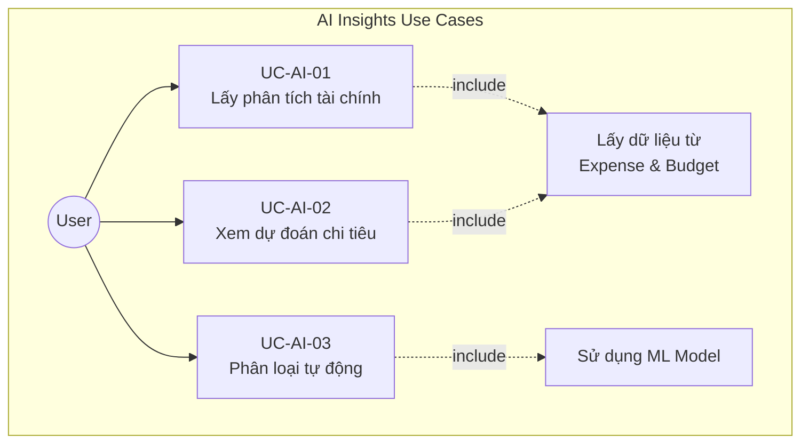
```mermaid
graph TB
    subgraph "AI Insights Use Cases"
        User((User))

        UC1[UC-AI-01<br/>Lấy phân tích tài chính]
        UC2[UC-AI-02<br/>Xem dự đoán chi tiêu]
        UC3[UC-AI-03<br/>Phân loại tự động]

        User --> UC1
        User --> UC2
        User --> UC3

        UC1 -.->|include| GET_DATA[Lấy dữ liệu từ<br/>Expense & Budget]
        UC2 -.->|include| GET_DATA
        UC3 -.->|include| ML_MODEL[Sử dụng ML Model]
    end
```

#### UC-AI-01: Lấy phân tích tài chính

| Thuộc tính          | Mô tả                                          |
| ------------------- | ---------------------------------------------- |
| **ID**              | UC-AI-01                                       |
| **Tên**             | Lấy phân tích tài chính                        |
| **Actor**           | User                                           |
| **Mô tả**           | AI phân tích xu hướng chi tiêu và đưa ra gợi ý |
| **Precondition**    | Đã đăng nhập, có dữ liệu chi tiêu              |
| **Postcondition**   | Hiển thị insights và recommendations           |
| **API Endpoint**    | `GET /api/v1/ai/insights`                      |
| **Service Pattern** | `ai.insights`                                  |

**Flow:**

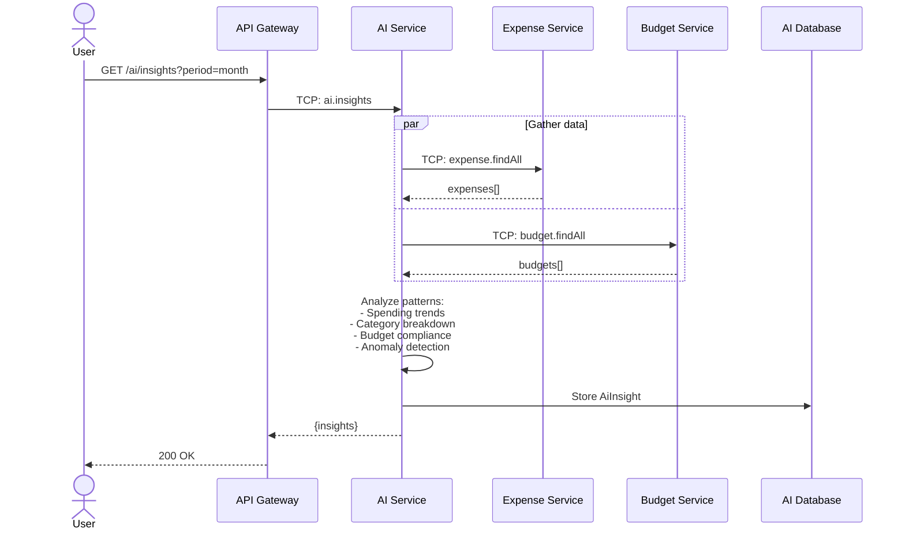
```mermaid
sequenceDiagram
    actor User
    participant Gateway as API Gateway
    participant AI as AI Service
    participant Expense as Expense Service
    participant Budget as Budget Service
    participant AIDB as AI Database

    User->>Gateway: GET /ai/insights?period=month
    Gateway->>AI: TCP: ai.insights

    par Gather data
        AI->>Expense: TCP: expense.findAll
        Expense-->>AI: expenses[]
    and
        AI->>Budget: TCP: budget.findAll
        Budget-->>AI: budgets[]
    end

    AI->>AI: Analyze patterns:<br/>- Spending trends<br/>- Category breakdown<br/>- Budget compliance<br/>- Anomaly detection
    AI->>AIDB: Store AiInsight
    AI-->>Gateway: {insights}
    Gateway-->>User: 200 OK
```

**Query Parameters:**

```typescript
{
  period?: 'week' | 'month' | 'quarter' | 'year';
  inputType?: string;
}
```

**Response:**

```typescript
{
  trends: {
    direction: 'up' | 'down' | 'stable';
    percentage: number;
    comparison: string;
  };
  recommendations: string[];
  predictions: {
    nextMonthEstimate: number;
    confidence: number;
  };
  alerts: string[];
  categoryAnalysis: Array<{
    category: string;
    total: number;
    trend: string;
    recommendation?: string;
  }>;
}
```

#### UC-AI-03: Phân loại tự động

| Thuộc tính          | Mô tả                                     |
| ------------------- | ----------------------------------------- |
| **ID**              | UC-AI-03                                  |
| **Tên**             | Phân loại khoản chi tự động               |
| **Actor**           | User                                      |
| **Mô tả**           | AI tự động đề xuất category cho khoản chi |
| **Precondition**    | Đã đăng nhập                              |
| **Postcondition**   | Trả về category đề xuất                   |
| **API Endpoint**    | `POST /api/v1/ai/categorize`              |
| **Service Pattern** | `ai.categorize`                           |

**Input:**

```typescript
{
  description: string;      // Mô tả khoản chi
  amount?: number;          // Số tiền (optional, hỗ trợ phân loại)
}
```

**Response:**

```typescript
{
  suggestedCategory: string;
  confidence: number; // 0-1
  alternatives: Array<{
    category: string;
    confidence: number;
  }>;
}
```

---

## 4. Ma Trận Actor - Use Case

| Use Case                 | Guest | User | Admin | System |
| ------------------------ | :---: | :--: | :---: | :----: |
| **Authentication**       |
| Đăng ký tài khoản        |   ✓   |      |       |        |
| Xác thực OTP             |   ✓   |      |       |        |
| Đăng nhập                |   ✓   |      |       |        |
| Làm mới Token            |       |  ✓   |   ✓   |        |
| Xem Profile              |       |  ✓   |   ✓   |        |
| Quên mật khẩu            |   ✓   |      |       |        |
| Đặt lại mật khẩu         |   ✓   |  ✓   |       |        |
| **Expense Management**   |
| Tạo khoản chi            |       |  ✓   |       |        |
| Xem danh sách chi tiêu   |       |  ✓   |       |        |
| Xem chi tiết khoản chi   |       |  ✓   |       |        |
| Cập nhật khoản chi       |       |  ✓   |       |        |
| Xóa khoản chi            |       |  ✓   |       |        |
| Xem báo cáo tổng hợp     |       |  ✓   |       |        |
| Xem danh mục             |   ✓   |  ✓   |       |        |
| **Budget Management**    |
| Tạo ngân sách            |       |  ✓   |       |        |
| Xem danh sách ngân sách  |       |  ✓   |       |        |
| Xem chi tiết ngân sách   |       |  ✓   |       |        |
| Cập nhật ngân sách       |       |  ✓   |       |        |
| Xóa ngân sách            |       |  ✓   |       |        |
| Theo dõi tiến độ         |       |  ✓   |       |        |
| **Blog/CMS**             |
| Xem danh sách bài viết   |   ✓   |  ✓   |   ✓   |        |
| Xem chi tiết bài viết    |   ✓   |  ✓   |   ✓   |        |
| Tạo bài viết             |       |      |   ✓   |        |
| Cập nhật bài viết        |       |      |   ✓   |        |
| Xóa bài viết             |       |      |   ✓   |        |
| **Subscription**         |
| Xem các gói dịch vụ      |   ✓   |  ✓   |       |        |
| Xem gói hiện tại         |       |  ✓   |       |        |
| Đăng ký gói              |       |  ✓   |       |        |
| Hủy đăng ký              |       |  ✓   |       |        |
| Xem lịch sử thanh toán   |       |  ✓   |       |        |
| **Notification**         |
| Xem thông báo            |       |  ✓   |       |        |
| Đánh dấu đã đọc          |       |  ✓   |       |        |
| Đánh dấu tất cả đã đọc   |       |  ✓   |       |        |
| Tạo thông báo (Internal) |       |      |       |   ✓    |
| **OCR**                  |
| Quét hóa đơn             |       |  ✓   |       |        |
| Xem lịch sử quét         |       |  ✓   |       |        |
| Xem chi tiết job         |       |  ✓   |       |        |
| **AI Insights**          |
| Lấy phân tích tài chính  |       |  ✓   |       |        |
| Xem dự đoán chi tiêu     |       |  ✓   |       |        |
| Phân loại tự động        |       |  ✓   |       |        |

---

## 5. Use Case Specifications

### Tóm tắt số lượng Use Cases theo Module

| Module             | Số lượng Use Cases |
| ------------------ | :----------------: |
| Authentication     |         7          |
| Expense Management |         7          |
| Budget Management  |         6          |
| Blog/CMS           |         5          |
| Subscription       |         5          |
| Notification       |         4          |
| OCR                |         3          |
| AI Insights        |         3          |
| **Tổng cộng**      |       **40**       |

### Use Case ID Convention

- `UC-AUTH-XX`: Authentication module
- `UC-EXP-XX`: Expense Management module
- `UC-BUD-XX`: Budget Management module
- `UC-BLOG-XX`: Blog/CMS module
- `UC-SUB-XX`: Subscription module
- `UC-NOTIF-XX`: Notification module
- `UC-OCR-XX`: OCR module
- `UC-AI-XX`: AI Insights module

---

## Appendix: Service Dependencies

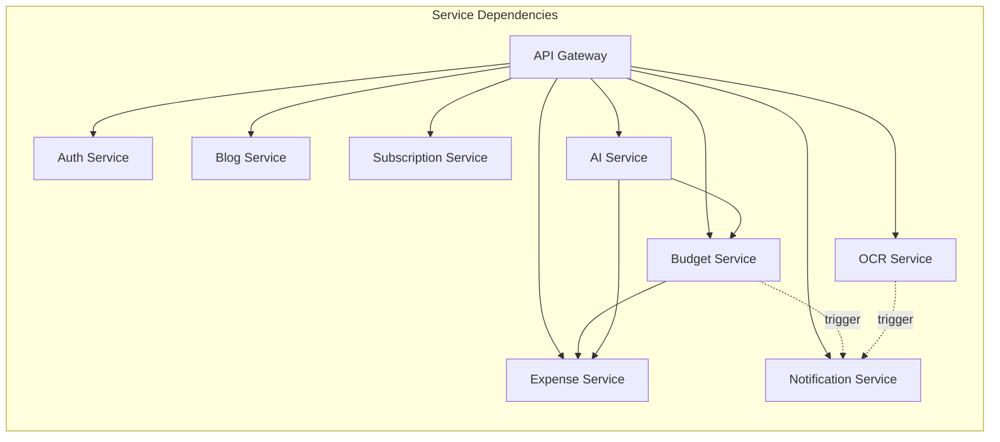
```mermaid
graph LR
    subgraph "Service Dependencies"
        Gateway[API Gateway]
        Auth[Auth Service]
        Expense[Expense Service]
        Budget[Budget Service]
        Blog[Blog Service]
        Sub[Subscription Service]
        Notif[Notification Service]
        OCR[OCR Service]
        AI[AI Service]

        Gateway --> Auth
        Gateway --> Expense
        Gateway --> Budget
        Gateway --> Blog
        Gateway --> Sub
        Gateway --> Notif
        Gateway --> OCR
        Gateway --> AI

        Budget --> Expense
        AI --> Expense
        AI --> Budget

        Budget -.->|trigger| Notif
        OCR -.->|trigger| Notif
    end
```

---

**Tài liệu được tạo**: December 19, 2025  
**Version**: 1.0.0  
**Tác giả**: FEPA Development Team
